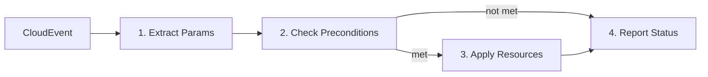
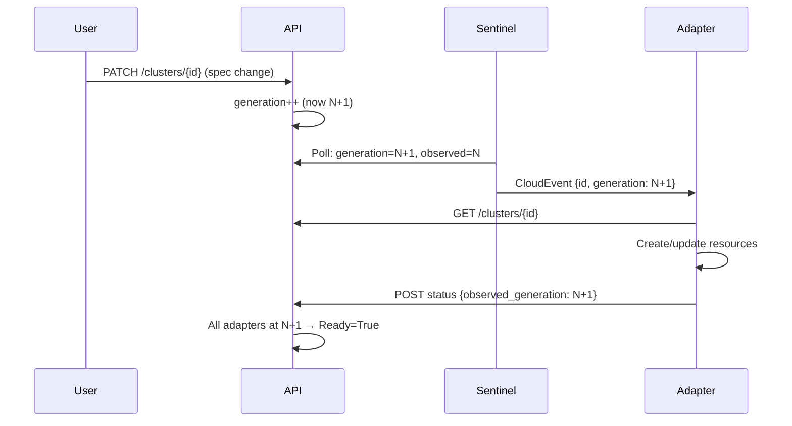
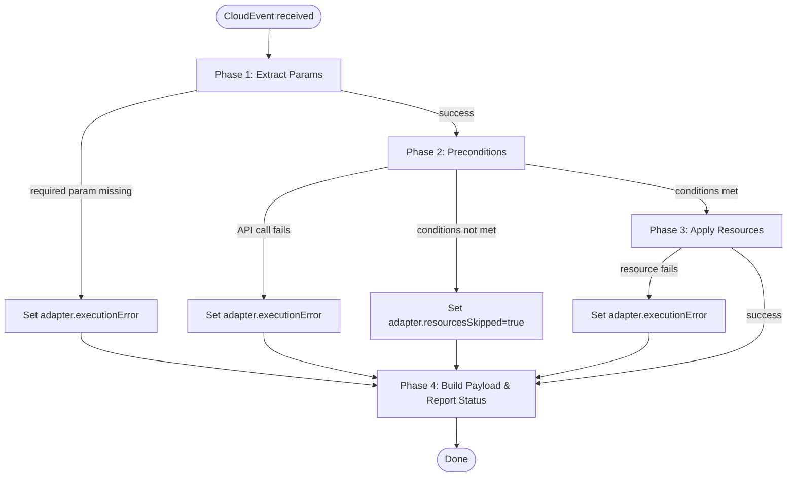
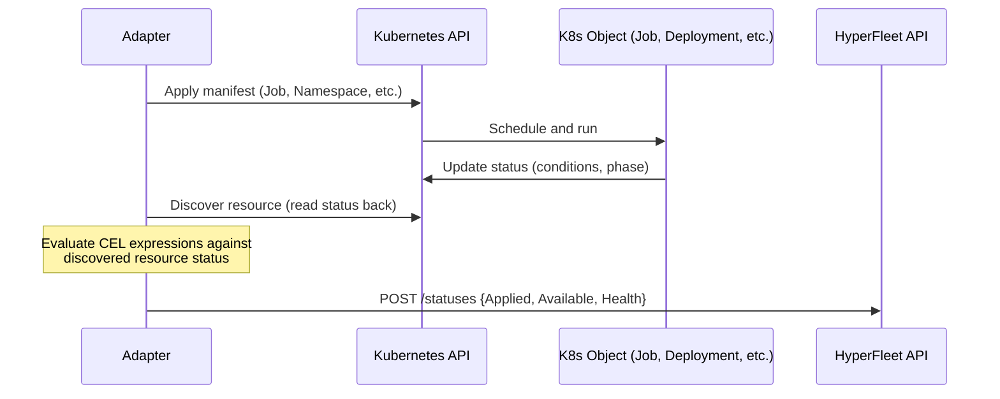

# HyperFleet Adapter Authoring Guide

> A practical guide for writing adapter configurations that extend the HyperFleet cluster lifecycle platform.

---

## 1. Introduction

An **adapter** is an event-driven worker that reacts to cluster lifecycle events, creates Kubernetes resources, and reports status back to the HyperFleet API. You don't write Go code to build an adapter — you write **YAML configuration** that the adapter framework binary executes.

Your custom logic lives in the Kubernetes objects created by adapters, the status conditions of these Kubernetes objects will be reported back by the adapter to the HyperFleet API offering external visibility to the managed objects.

This document uses "clusters" as an example of the entities modified by the user through the HyperFleet API, but the concepts apply to other entities, like node pools.

The flow of events goes like this:

customer updates cluster -> event -> adapter task -> k8s object performs work -> adapter reports status

### What you produce

Every adapter requires three YAML files:

| File | Kind | Purpose |
|------|------|---------|
| `adapter-config.yaml` | `AdapterConfig` | Deployment settings: API client config, broker subscription, timeouts, retries |
| `adapter-task-config.yaml` | `AdapterTaskConfig` | Business logic: what to extract, check, create, and report |
| `broker.yaml` | `` | Broker configuration: Configures broker system (pubsub, rabbitmq) |

The `AdapterConfig` is pretty straightforward, it defines the name of the adapter as well as client configs to interact with HyperFleet API, Kubernetes or Maestro.

Your main authoring effort goes into the `AdapterTaskConfig` which configures the tasks to execute for every object changed by the customer

### When you need a new adapter

Create a new adapter when you need to:

- Provision a new type of infrastructure per cluster (namespace, RBAC, DNS, certificates)
- Validate cluster prerequisites before provisioning
- Manage resources on a remote cluster via Maestro/ManifestWork

### Development workflow

```
Write task config → Dry-run locally → Inspect trace → Iterate → Deploy
```

The framework includes a **dry-run mode** that simulates the full execution pipeline without any infrastructure. You can validate your configuration before touching a real cluster.

---

## 2. Concepts

### Event-driven execution

When a cluster is created or updated, the **Sentinel** detects the change and publishes a lightweight CloudEvent to a message broker. Your adapter receives this event and executes a four-phase pipeline:



Post-actions (phase 4) **always execute**, even when preconditions are not met or resources fail. This ensures the adapter always reports its state back to the API.

### Generation-based reconciliation

Every spec change increments a cluster's `generation` counter. Adapters report `observed_generation` with their status. When `generation > observed_generation`, the Sentinel publishes an event to trigger reconciliation.



### Anemic events

Information carried by the events is the minimum to identify the changed object by the adapters.
For example for a NodePool, it will require both the Id of the NodePool and the Id of the Cluster it belongs.

The format of the event is CloudEvents.

```json
{
  "data": {
    "id": "abc123",
    "kind": "Cluster",
    "href": "/api/hyperfleet/v1/clusters/abc123",
    "generation": 5
  }
}
```

The adapter fetches the full resource from the API during preconditions phase.
This keeps the event schema stable and ensures the adapter always works with fresh data.

### Configuration languages

Three languages appear in adapter configs, each for a different purpose:

| Language | Syntax | Use for |
|----------|--------|---------|
| Go Templates | `{{ .clusterId }}` | String interpolation in URLs, manifest fields, direct values |
| CEL | `expression: "..."` | Logic evaluation in preconditions, status conditions, computed values |
| JSONPath | `field: "path"` | Simple field extraction from API responses |

**Rule of thumb:** Use Go Templates for inserting values into strings. Use CEL when you need conditionals, array filtering, or type-safe logic. Use `field:` for straightforward extraction from API responses.

---

## 3. Configuration Structure

### File skeleton

```yaml
apiVersion: hyperfleet.redhat.com/v1alpha1
kind: AdapterTaskConfig
metadata:
  name: my-adapter          # Unique adapter name (used in status reports and logs)
  labels:
    hyperfleet.io/adapter-type: my-adapter
    hyperfleet.io/component: adapter

spec:
  params: []            # Phase 1: Extract variables from event and environment
  preconditions: []     # Phase 2: Validate state via API calls
  resources: []         # Phase 3: Create/update Kubernetes resources
  post:                 # Phase 4: Report status
    payloads: []        #   Build status JSON
    postActions: []     #   Send status to API
```

### Execution flow and error handling



The `adapter.*` context is populated automatically and available in your post-action CEL expressions:

| Variable | Type | Description |
|----------|------|-------------|
| `adapter.executionStatus` | string | `"success"` or `"failed"` |
| `adapter.resourcesSkipped` | bool | `true` if preconditions were not met |
| `adapter.skipReason` | string | Why resources were skipped |
| `adapter.executionError.phase` | string | Phase where error occurred |
| `adapter.executionError.step` | string | Specific step that failed |
| `adapter.executionError.message` | string | Error details |

---

## 4. Parameter Extraction

Parameters are variables extracted from the incoming CloudEvent and the runtime environment. They become available as Go Template variables (`{{ .paramName }}`) and CEL variables throughout the rest of the config.

```yaml
spec:
  params:
    # From the CloudEvent data
    - name: "clusterId"
      source: "event.id"
      type: "string"
      required: true

    - name: "generation"
      source: "event.generation"
      type: "int"
      required: true

    # From environment variables (set in Helm values or deployment)
    - name: "region"
      source: "env.REGION"
      type: "string"
      default: "us-east-1"
```

### Sources

| Prefix | Source | Example |
|--------|--------|---------|
| `event.` | CloudEvent data fields | `event.id`, `event.generation`, `event.kind` |
| `env.` | Environment variables | `env.REGION`, `env.NAMESPACE` |
| `secret.` | Kubernetes Secret | `secret.my-ns.my-secret.api-key` |
| `configmap.` | Kubernetes ConfigMap | `configmap.my-ns.my-config.setting` |

### Types and conversion

| Type | Accepts |
|------|---------|
| `string` | Any value (default) |
| `int`, `int64` | Integers, numeric strings, floats (truncated) |
| `float`, `float64` | Numeric values |
| `bool` | `true/false`, `yes/no`, `on/off`, `1/0` |

If type conversion fails on a **required** param, execution stops. On an optional param, the `default` value is used.

### Common parameters

Most adapters need at least `clusterId` and `generation` from the event. These are the minimum to identify what cluster changed and at what generation.

---

## 5. Preconditions

A precondition is used to decide if the Resource phase executes or not.

Preconditions validate cluster state before the adapter creates resources. They run **sequentially** — each precondition can use data captured by previous ones.

Usually an API call to the HyperFleet API will be the first action of the Precondition phase, to extract values from the current state of the cluster.

The state of the cluster contains information about all adapters in the form of `conditions[]`, so it can be used to make one adapter depend on the results of another adapter.

### Making an API call

```yaml
preconditions:
  - name: "clusterStatus"
    apiCall:
      method: "GET"
      url: "/api/hyperfleet/v1/clusters/{{ .clusterId }}"
      timeout: 10s
      retryAttempts: 3
      retryBackoff: "exponential"    # also: linear, constant
```

URLs are **relative** — the base URL comes from the `AdapterConfig` `clients.hyperfleetApi.baseUrl` setting. You only write the path.

### Capturing fields

After the API call, capture values from the response for use in later phases. Two extraction modes are available (`field` or `expression`)— use one per capture, not both:

```yaml
    capture:
      # Simple field extraction (dot notation or JSONPath)
      - name: "clusterName"
        field: "name"

      # CEL expression for computed values
      - name: "readyStatus"
        expression: |
          status.conditions.filter(c, c.type == "Ready").size() > 0
            ? status.conditions.filter(c, c.type == "Ready")[0].status
            : "False"

      # JSONPath with filter
      - name: "lzNamespaceStatus"
        field: "{.items[?(@.adapter=='landing-zone')].data.namespace.status}"
```

> **Scope:** Capture expressions can only see the current API response. They cannot reference params or other captured values.

### Evaluating conditions

After captures, evaluate conditions to decide whether to proceed. Two syntaxes are available:

**Structured conditions** — declarative, readable for simple checks:

```yaml
    conditions:
      - field: "readyStatus"
        operator: "equals"
        value: "False"
```

**CEL expression** — for complex logic:

```yaml
    expression: |
      readyStatus == "False" && clusterStatus.spec.nodeCount > 0
```

> **Scope:** Conditions see the **full execution context**: all params, all captured fields, and the full API response accessible via the precondition name (e.g., `clusterStatus.status.conditions`).

### Supported operators

| Operator | Description |
|----------|-------------|
| `equals` | Exact match |
| `notEquals` | Not equal |
| `in` | Value is in array |
| `notIn` | Value is not in array |
| `contains` | String contains substring |
| `greaterThan` | Numeric greater than |
| `lessThan` | Numeric less than |
| `exists` | Field exists (no value needed) |
| `notExists` | Field does not exist (no value needed) |
| `greaterThanOrEqual` | Numeric greater than or equal |
| `lessThanOrEqual` | Numeric less than or equal |

### Chaining preconditions

Preconditions execute in order. Data flows forward — a captured field from precondition 1 is available in precondition 2's conditions:

```yaml
preconditions:
  - name: "getCluster"
    apiCall:
      url: "/api/hyperfleet/v1/clusters/{{ .clusterId }}"
    capture:
      - name: "clusterName"
        field: "name"

  - name: "getStatuses"
    apiCall:
      url: "/api/hyperfleet/v1/clusters/{{ .clusterId }}/statuses"
    capture:
      - name: "lzReady"
        field: "{.items[?(@.adapter=='landing-zone')].data.namespace.status}"
    conditions:
      - field: "lzReady"
        operator: "equals"
        value: "Active"
```

When a condition is **not met**, the adapter skips the resources phase but still runs post-actions. The `adapter.resourcesSkipped` flag is set to `true` and `adapter.skipReason` describes why.

---

## 6. Resources

Resources define the Kubernetes objects your adapter creates on the management cluster. They execute **sequentially** in the order listed — a namespace defined first is available for resources defined after it.

### Inline manifests

```yaml
resources:
  - name: "clusterNamespace"
    transport:
      client: "kubernetes"
    manifest:
      apiVersion: v1
      kind: Namespace
      metadata:
        name: "{{ .clusterId | lower }}"
        labels:
          hyperfleet.io/cluster-id: "{{ .clusterId }}"
          hyperfleet.io/managed-by: "{{ .metadata.name }}"
          hyperfleet.io/resource-type: "namespace"
        annotations:
          hyperfleet.io/generation: "{{ .generation }}"
    discovery:
      byName: "{{ .clusterId | lower }}"
```

### External manifest files

For larger manifests, reference an external YAML file:

```yaml
resources:
  - name: "validationJob"
    transport:
      client: "kubernetes"
    manifest:
      ref: "/etc/adapter/job.yaml"
    discovery:
      namespace: "{{ .clusterId }}"
      bySelectors:
        labelSelector:
          hyperfleet.io/cluster-id: "{{ .clusterId }}"
          hyperfleet.io/resource-type: "job"
```

Note that the location of the referenced file is a path of the adapter pod, so it has to be mounted from a ConfigMap in the adapter deployment.

The referenced file is a Go template and has access to all params and captured fields.

### Resource lifecycle

The framework determines the operation automatically:

| Operation | When | Behavior |
|-----------|------|----------|
| `create` | Resource doesn't exist | Apply the manifest |
| `update` | Resource exists, generation changed | Patch the resource |
| `skip` | Resource exists, generation unchanged | No-op (idempotent) |
| `recreate` | `recreateOnChange: true` is set | Delete then create |

### Discovery

After applying a resource, the framework **discovers** it to read its server-populated state (status, uid, resourceVersion). This state is then available in post-action CEL expressions via `resources.<name>`.

Two discovery modes:

```yaml
# By name (direct lookup)
discovery:
  byName: "{{ .clusterId | lower }}"

# By label selector
discovery:
  namespace: "{{ .clusterId }}"       # omit or "*" for cluster-scoped
  bySelectors:
    labelSelector:
      hyperfleet.io/cluster-id: "{{ .clusterId }}"
      hyperfleet.io/resource-type: "namespace"
```

### Labeling conventions

Always label your resources for discovery and traceability:

| Label | Purpose |
|-------|---------|
| `hyperfleet.io/cluster-id` | Associate resource with a cluster |
| `hyperfleet.io/managed-by` | Adapter that owns this resource |
| `hyperfleet.io/resource-type` | Resource category for discovery |
| `hyperfleet.io/generation` | Generation that created/updated this resource (annotation) |

### Transport types

Different transport types are available for resources:

- Kubernetes: makes use of an active Kubernetes configuration to create k8s objects using the Kubernetes API
  - The credentials can be specified using a custom KubeConfigPath in the `AdapterConfig`
  - Or using in-cluster configuration to deploy to the same cluster the Adapter is running
- Maestro: connects to a maestro server to send manifestworks which can contain many resources as manifests

#### Kubernetes (direct)

The default. Resources are applied directly to the management cluster's API server.

```yaml
resources:
  - name: "myResource"
    transport:
      client: "kubernetes"
    manifest:
      # ... standard K8s manifest
```

#### Maestro (remote clusters via ManifestWork)

For resources that need to land on a remote spoke cluster managed through Open Cluster Management / Maestro. The manifest is a `ManifestWork` that wraps the actual resources.

<details>

<summary>Maestro adapter-task-config example</summary>

```yaml
resources:
  - name: "clusterSetup"
    transport:
      client: "maestro"
      maestro:
        targetCluster: "{{ .placementClusterName }}"
    manifest:
      apiVersion: work.open-cluster-management.io/v1
      kind: ManifestWork
      metadata:
        name: "manifestwork-{{ .clusterId }}"
        labels:
          hyperfleet.io/cluster-id: "{{ .clusterId }}"
      spec:
        workload:
          manifests:
            - apiVersion: v1
              kind: Namespace
              metadata:
                name: "{{ .clusterId | lower }}"
                labels:
                  hyperfleet.io/cluster-id: "{{ .clusterId }}"
                  hyperfleet.io/resource-type: "namespace"
            - apiVersion: v1
              kind: ConfigMap
              metadata:
                name: "{{ .clusterId }}-config"
                namespace: "{{ .clusterId | lower }}"
              data:
                cluster_id: "{{ .clusterId }}"
        manifestConfigs:
          - resourceIdentifier:
              group: ""
              resource: "namespaces"
              name: "{{ .clusterId | lower }}"
            updateStrategy:
              type: "ServerSideApply"
            feedbackRules:
              - type: "JSONPaths"
                jsonPaths:
                  - name: "phase"
                    path: ".status.phase"
    discovery:
      bySelectors:
        labelSelector:
          hyperfleet.io/cluster-id: "{{ .clusterId }}"
```

</details>

#### Nested discovery (Maestro)

A ManifestWork bundles multiple sub-resources. To inspect those sub-resources individually in your post-action CEL expressions without traversing the whole resources tree, you can use `nestedDiscoveries`:

```yaml
    nestedDiscoveries:
      - name: "namespace0"
        discovery:
          bySelectors:
            labelSelector:
              hyperfleet.io/resource-type: "namespace"
      - name: "configmap0"
        discovery:
          byName: "{{ .clusterId }}-config"
```

Nested discoveries are **promoted to top-level keys** in the `resources` map. Access them as `resources.namespace0`, not `resources.clusterSetup.namespace0`. This keeps CEL expressions clean.

Beside this shortcut, the nested Discovery also allows accessing status data from the resource such as statusFeedback and conditions.

---

## 7. The Status Contract: Kubernetes Objects and the Adapter

The adapter creates Kubernetes objects that do the real work — Jobs that run validation scripts, Deployments that provision infrastructure, ConfigMaps that hold configuration. The adapter then reads the **status** of these objects and translates it into a report for the HyperFleet API.

This means there is a contract between your Kubernetes objects and your adapter configuration: the adapter needs to know where to look in the object's status to determine whether the work succeeded.

### How the feedback loop works



The adapter does **not** wait for the workload to complete. It reads whatever status is available at discovery time and reports it. If the object is still pending, the adapter reports `Available=False`. The Sentinel will trigger another reconciliation cycle later, and the adapter will read the updated status then.

More information about the adapter contract can be found in [Architecture repository - HyperFleet Adapter Status Contract](https://github.com/openshift-hyperfleet/architecture/blob/main/hyperfleet/components/adapter/framework/adapter-status-contract.md)

### What your Kubernetes objects must expose

The adapter reads status from the standard Kubernetes status subresource. The three conditions it reports to the HyperFleet API map to questions about your workload:

| Adapter Condition | What it maps to on the K8s object | Example |
|-------------------|-----------------------------------|---------|
| **Applied** | Does the resource exist? Was it accepted by the API server? | `has(resources.myJob)` — the manifest was applied successfully |
| **Available** | Is the workload operational? Has it completed or reached a ready state? | Job: `status.conditions` contains `type=Complete, status=True`. Namespace: `status.phase == "Active"`. Deployment: `status.availableReplicas > 0` |
| **Health** | Did the adapter framework itself execute without errors? | This comes from `adapter.*` metadata, not from the K8s object |

The possible values for these conditions statuses are: `True`, `False` and `Unknown`.

The `Unknown` value is used when there the condition value is still pending and there is no valid answer yet. Since adapters report always to the API, the status payload should account for this case.

**Applied** and **Available** are derived from your K8s object's status. **Health** reflects the adapter framework's own execution and uses the standard boilerplate (see section 8).

### Status patterns by resource type

Different Kubernetes resource types expose status differently. Your CEL expressions in the post-action payload need to match the status shape of the objects you create.

#### Namespace

Namespaces have a simple `status.phase` field:

```yaml
# Available when namespace is Active
status:
  expression: |
    resources.?clusterNamespace.?status.?phase.orValue("") == "Active"
      ? "True" : "False"
```

#### Job

Jobs use a `conditions` array. A completed Job has a condition with `type=Complete`:

```yaml
# Available when Job has completed successfully
status:
  expression: |
    resources.?validationJob.?status.?conditions.orValue([])
      .exists(c, c.type == "Complete" && c.status == "True")
    ? "True"
    : resources.?validationJob.?status.?conditions.orValue([])
        .exists(c, c.type == "Failed" && c.status == "True")
      ? "False"
      : "Unknown"
```

A Job that is still running will have no `Complete` or `Failed` condition — the adapter reports `Unknown`, and the next Sentinel cycle will re-evaluate.

#### Custom workloads with conditions

If your workload is a CRD or operator-managed resource that sets its own conditions, read them the same way:

```yaml
# Available when custom resource reports Ready=True
status:
  expression: |
    resources.?myResource.?status.?conditions.orValue([])
      .exists(c, c.type == "Ready" && c.status == "True")
    ? "True" : "False"
```

#### ManifestWork (Maestro)

ManifestWork status is richer — it includes both top-level conditions and per-manifest `statusFeedback`. Use nested discoveries to access individual sub-resource status:

```yaml
# Available from the ManifestWork's own conditions
status:
  expression: |
    resources.?clusterSetup.?status.?conditions.orValue([])
      .filter(c, c.type == "Available").size() > 0
    ? resources.clusterSetup.status.conditions
        .filter(c, c.type == "Available")[0].status
    : "False"

# Or from a nested discovery's statusFeedback
status:
  expression: |
    has(resources.namespace0)
      && has(resources.namespace0.statusFeedback)
      && has(resources.namespace0.statusFeedback.values)
      && resources.namespace0.statusFeedback.values
          .filter(v, v.name == "phase").size() > 0
      && resources.namespace0.statusFeedback.values
          .filter(v, v.name == "phase")[0].fieldValue.string == "Active"
    ? "True" : "False"
```

### Designing your workload for observability

When building the Kubernetes objects that your adapter manages, keep these guidelines in mind:

- **Use standard Kubernetes condition conventions** (`type`, `status`, `reason`, `message`). The adapter's CEL expressions are designed to work with this pattern.
- **Set conditions on your CRDs.** If you control the workload (e.g., a custom operator), have it report `Available`, `Ready`, or `Complete` conditions so the adapter can read them directly.
- **For Jobs, use success/failure exit codes.** Kubernetes automatically sets `Complete` or `Failed` conditions based on container exit codes. The adapter reads these without extra work.
- **For Maestro, configure `feedbackRules`.** Without them, the ManifestWork status won't include sub-resource state, and your nested discoveries will have no data to report on.

### The reconciliation loop

Because the adapter reads status at a point in time, the overall flow is a **convergence loop**:

1. First cycle: adapter creates resources, discovers them immediately — status may be `Pending` or `Unknown`
2. Adapter reports `Applied=True, Available=Unknown` to the API
3. Sentinel detects the cluster is not yet Ready (generation mismatch or max-age exceeded)
4. Next cycle: adapter discovers the same resources — status has progressed to `Active` or `Complete`
5. Adapter reports `Applied=True, Available=True`
6. API aggregates: all adapters at current generation with `Available=True` → cluster is `Ready`

This means your adapter does not need to poll or wait. The framework and Sentinel handle retry timing. Your job is to write CEL expressions that correctly read the current state, whatever it may be.

---

## 8. Post-Actions (Status Reporting)

> The post-action payload is where you wire the status patterns from Section 7 into the actual report sent to the API.

Post-actions build a status payload and send it to the HyperFleet API. This is how the system knows your adapter's work is done (or failed, or in progress).

The process has two steps: **build payloads**, then **execute post actions**.

### Building payloads

A payload is a JSON structure built from CEL expressions and Go Templates. Each field can be specified in three ways:

| Form | Example | Use when |
|------|---------|----------|
| Direct string | `adapter: "my-adapter"` | Static values |
| CEL expression | `status: { expression: "..." }` | Computed values, conditionals |
| Field extraction | `status: { field: "path", default: "..." }` | Simple field reads |

### Condition types

Every adapter status reports three condition types:

| Type | Question it answers |
|------|---------------------|
| **Applied** | Were the Kubernetes resources created/configured? |
| **Available** | Are the resources operational and serving? |
| **Health** | Did the adapter execution itself succeed? |

### Minimal payload example

<details><summary>Minimal payload example</summary>

```yaml
post:
  payloads:
    - name: "statusPayload"
      build:
        adapter: "{{ .metadata.name }}"
        conditions:
          - type: "Applied"
            status:
              expression: |
                has(resources.clusterNamespace) ? "True" : "False"
            reason:
              expression: |
                has(resources.clusterNamespace) ? "Applied" : "Pending"
            message:
              expression: |
                has(resources.clusterNamespace)
                  ? "Resources applied successfully"
                  : "Resources pending"

          - type: "Available"
            status:
              expression: |
                resources.?clusterNamespace.?status.?phase.orValue("") == "Active"
                  ? "True" : "False"
            reason:
              expression: |
                resources.?clusterNamespace.?status.?phase.orValue("") == "Active"
                  ? "NamespaceReady" : "NamespaceNotReady"
            message:
              expression: |
                resources.?clusterNamespace.?status.?phase.orValue("") == "Active"
                  ? "Namespace is active" : "Namespace not yet active"

          - type: "Health"
            # ... (see standard boilerplate below)

        observed_generation:
          expression: "generation"
        observed_time: "{{ now | date \"2006-01-02T15:04:05Z07:00\" }}"

  postActions:
    - name: "reportStatus"
      apiCall:
        method: "POST"
        url: "/api/hyperfleet/v1/clusters/{{ .clusterId }}/statuses"
        body: "{{ .statusPayload }}"
```

</details>

### The `observed_generation` gotcha

Always use a **CEL expression** for `observed_generation`, not a Go Template. Go Templates output strings, but the API expects an integer. CEL preserves the numeric type:

```yaml
# Correct — preserves integer type
observed_generation:
  expression: "generation"

# Wrong — sends a string "5" instead of integer 5
observed_generation: "{{ .generation }}"
```

### The Health condition boilerplate

The Health condition follows a standard pattern that surfaces execution errors and skip reasons. Copy this into your adapter and leave it as-is:

<details>
<summary>Standard Health condition (click to expand)</summary>

```yaml
- type: "Health"
  status:
    expression: |
      adapter.?executionStatus.orValue("") == "success"
        && !adapter.?resourcesSkipped.orValue(false)
      ? "True"
      : "False"
  reason:
    expression: |
      adapter.?executionStatus.orValue("") != "success"
      ? "ExecutionFailed:" + adapter.?executionError.?phase.orValue("unknown")
      : adapter.?resourcesSkipped.orValue(false)
        ? "ResourcesSkipped"
        : "Healthy"
  message:
    expression: |
      adapter.?executionStatus.orValue("") != "success"
      ? "Adapter failed at phase ["
          + adapter.?executionError.?phase.orValue("unknown")
          + "] step ["
          + adapter.?executionError.?step.orValue("unknown")
          + "]: "
          + adapter.?executionError.?message.orValue(
              adapter.?errorMessage.orValue("no details"))
      : adapter.?resourcesSkipped.orValue(false)
        ? "Resources skipped: " + adapter.?skipReason.orValue("unknown reason")
        : "Adapter execution completed successfully"
```

</details>

### The `data` field

Optionally attach adapter-specific metrics extracted from your resources:

```yaml
        data:
          namespace:
            name:
              expression: |
                resources.?clusterNamespace.?metadata.?name.orValue("")
            phase:
              expression: |
                resources.?clusterNamespace.?status.?phase.orValue("")
```

### How status aggregation works

When your adapter reports status, the API aggregates across **all registered adapters**:

- **Available** = all adapters report `Available=True` at *any* generation (last known good)
- **Ready** = all adapters report `Available=True` at the *current* generation (fully reconciled)

Your adapter name must be registered in the `HYPERFLEET_CLUSTER_ADAPTERS` environment variable on the API for it to participate in aggregation.

---

## 9. Dry-Run Mode

Dry-run mode simulates the full execution pipeline locally. No Kubernetes cluster, no message broker, no API server needed. This is useful to test the creation of adapter-task-config files, as expressions can get complex and going through the real cycle of deploying the adapter is slow.

### Running a dry-run

```bash
hyperfleet-adapter serve \
  --config ./adapter-config.yaml \
  --task-config ./adapter-task-config.yaml \
  --dry-run-event ./event.json \
  --dry-run-api-responses ./api-responses.json \
  --dry-run-discovery ./discovery-overrides.json \
  --dry-run-verbose \
  --dry-run-output text    # or "json"
```

### Mock input files

You need three files to simulate the environment.

#### 1. Event file (`event.json`)

A standard CloudEvent with the data your adapter expects:
<details><summary>event file example</summary>

```json
{
  "specversion": "1.0",
  "id": "abc123",
  "type": "io.hyperfleet.cluster.updated",
  "source": "/api/hyperfleet/v1/clusters/abc123",
  "data": {
    "id": "abc123",
    "kind": "Cluster",
    "href": "/api/hyperfleet/v1/clusters/abc123",
    "generation": 5
  }
}
```

</details>

#### 2. API responses (`api-responses.json`)

Mock responses matched by HTTP method and URL regex. Supports sequential responses for endpoints called multiple times:

<details><summary>HyperFleet API response for statuses update</summary>

```json
{
  "responses": [
    {
      "match": {
        "method": "GET",
        "urlPattern": "/api/hyperfleet/v1/clusters/.*"
      },
      "responses": [
        {
          "statusCode": 200,
          "body": {
            "id": "abc123",
            "name": "my-cluster",
            "generation": 5,
            "status": {
              "conditions": [
                { "type": "Ready", "status": "False" }
              ]
            }
          }
        }
      ]
    },
    {
      "match": {
        "method": "POST",
        "urlPattern": "/api/hyperfleet/v1/clusters/.*/statuses"
      },
      "responses": [
        { "statusCode": 200, "body": {} }
      ]
    }
  ]
}
```

</details>

#### 3. Discovery overrides (`discovery-overrides.json`)

Simulates the server-populated fields (uid, resourceVersion, status) that Kubernetes would add after creating resources. Keys are the **rendered resource names**:

```json
{
  "abc123": {
    "apiVersion": "v1",
    "kind": "Namespace",
    "metadata": {
      "name": "abc123",
      "uid": "a1b2c3d4-e5f6-7890-abcd-ef1234567890",
      "resourceVersion": "100"
    },
    "status": {
      "phase": "Active"
    }
  }
}
```

### Reading the trace output

The trace walks through each phase showing what happened:

<details><summary>Example of a Dry-run execution</summary>

```
Dry-Run Execution Trace
========================
Event: id=abc123 type=io.hyperfleet.cluster.updated

Phase 1: Parameter Extraction .............. SUCCESS
  clusterId        = "abc123"
  generation       = 5
  region           = "us-east-1"

Phase 2: Preconditions ..................... SUCCESS (MET)
  [1/1] fetch-cluster                      PASS
    API Call: GET /api/hyperfleet/v1/clusters/abc123 -> 200
    Captured: clusterName = "my-cluster"
    Captured: readyStatus = "False"

Phase 3: Resources ........................ SUCCESS
  [1/2] namespace0                         CREATE
    Kind: Namespace    Namespace:            Name: abc123
  [2/2] configmap0                         CREATE
    Kind: ConfigMap    Namespace: abc123     Name: abc123-config

Phase 3.5: Discovery Results ................. (available as resources.* in payload)
  namespace0:
    {"apiVersion":"v1","kind":"Namespace","metadata":{"name":"abc123",...},"status":{"phase":"Active"}}

Phase 4: Post Actions ..................... SUCCESS
  [1/1] update-status                      EXECUTED
    API Call: POST /api/hyperfleet/v1/clusters/abc123/statuses -> 200

Result: SUCCESS
```

</details>

Use `--dry-run-verbose` to see rendered manifests and full API request/response bodies. Use `--dry-run-output json` for machine-readable output you can pipe into `jq`.

### Development loop

1. Write your `adapter-task-config.yaml`
2. Create mock files for a representative cluster
3. Run dry-run, inspect the trace
4. Fix config issues, re-run
5. Test edge cases: change mock API responses to simulate different cluster states (Ready=True, missing fields, error responses)
6. Deploy when the trace shows the expected behavior

---

## 10. NodePool Adapters

NodePool adapters follow the same pattern as cluster adapters with a few differences.

### Event structure

NodePool events include an `owned_reference` pointing to the parent cluster:

```yaml
params:
  - name: "clusterId"
    source: "event.owned_reference.id"    # Parent cluster
    type: "string"
    required: true

  - name: "nodepoolId"
    source: "event.id"                    # The NodePool itself
    type: "string"
    required: true
```

### Checking parent cluster readiness

NodePool adapters typically wait for the parent cluster to be fully set up. Query the parent cluster's adapter statuses as a precondition:

<details><summary>NodePool precondition example</summary>

```yaml
preconditions:
  - name: "nodepoolStatus"
    apiCall:
      url: "/api/hyperfleet/v1/clusters/{{ .clusterId }}/nodepools/{{ .nodepoolId }}"
    capture:
      - name: "generationSpec"
        field: "generation"
      - name: "readyStatus"
        expression: |
          status.conditions.filter(c, c.type == "Ready").size() > 0
            ? status.conditions.filter(c, c.type == "Ready")[0].status
            : "False"
    conditions:
      - field: "readyStatus"
        operator: "equals"
        value: "False"

  - name: "clusterAdapterStatus"
    apiCall:
      url: "/api/hyperfleet/v1/clusters/{{ .clusterId }}/statuses"
    capture:
      - name: "clusterNamespaceStatus"
        field: "{.items[?(@.adapter=='landing-zone')].data.namespace.status}"
    conditions:
      - field: "clusterNamespaceStatus"
        operator: "equals"
        value: "Active"
```

</details>

### Reporting NodePool status

Post-actions target the NodePool status endpoint instead of the cluster one:

```yaml
postActions:
  - name: "reportNodepoolStatus"
    apiCall:
      method: "POST"
      url: "/api/hyperfleet/v1/clusters/{{ .clusterId }}/nodepools/{{ .nodepoolId }}/statuses"
      body: "{{ .nodepoolStatusPayload }}"
```

Register NodePool adapters in `HYPERFLEET_NODEPOOL_ADAPTERS` (not `HYPERFLEET_CLUSTER_ADAPTERS`).

---

## 11. Testing and Validation

### Configuration validation

The framework validates your config at load time in two passes:

**Structural validation** — checked always:

- Required fields present (`name`, `source`, `method`, etc.)
- Valid operator values
- Mutual exclusivity (`field` vs `expression`, `build` vs `buildRef`)
- Valid Kubernetes resource names

**Semantic validation** — checked by default (can be skipped):

- CEL expressions parse without errors
- Go template variables reference defined params or captures
- K8s manifests have required fields (`apiVersion`, `kind`, `metadata.name`)
- `in`/`notIn` operators have array values

### No-op adapter pattern

To test preconditions and post-actions without creating any resources, leave the resources section empty:

```yaml
resources: []
```

The adapter will run preconditions, skip straight to post-actions, and report status. Useful for validation adapters or framework testing.

### Common validation errors

| Error | Cause | Fix |
|-------|-------|-----|
| `required field missing` | Param without `name` or `source` | Add the required field |
| `mutually exclusive` | Both `field` and `expression` on a capture | Use only one |
| `CEL parse error` | Invalid CEL syntax | Check parentheses, string escaping |
| `template variable not found` | `{{ .foo }}` where `foo` is not a param or capture | Define it in params or captures |
| `invalid operator` | Typo in operator name | Use one from the supported list |

---

## 12. Deployment Checklist

1. **Register your adapter name** in the HyperFleet API's `HYPERFLEET_CLUSTER_ADAPTERS` (or `HYPERFLEET_NODEPOOL_ADAPTERS`) environment variable. Without this, the API won't include your adapter in status aggregation.

- The API will compute the `Ready` condition of the managed object as when all registered adapters have reported `True` as their `Available` condition status.

1. **Create the AdapterConfig** with your environment's API endpoint, broker subscription, and client settings:

<details><summary>Example minimal adapter-config</summary>

```yaml
apiVersion: hyperfleet.redhat.com/v1alpha1
kind: AdapterConfig
metadata:
  name: my-adapter
spec:
  adapter:
    version: "0.1.0"
  clients:
    hyperfleetApi:
      baseUrl: "http://hyperfleet-api:8000"
      timeout: 10s
      retryAttempts: 3
      retryBackoff: exponential
    broker:
      subscriptionId: "my-adapter-sub"
      topic: "cluster-events"
    kubernetes:
      apiVersion: "v1"
```

</details>

1. **Deploy using the Helm chart** — the generic `adapter/` chart mounts your task config as a ConfigMap and sets the environment variables.

2. **Set up broker subscription** — ensure your adapter has a dedicated subscription on the cluster events topic so it receives events independently of other adapters (fan-out pattern).

3. Set permissions for the adapter to read from the broker subscription. This is cloud provider specific.

- E.g. In GCP you can use Workload Identity Federation to assign `role/pubsub.subscriber` directly to the k8s service account for the adapters.

More information about deployment can be found in [Architecture repository - HyperFleet Adapter Framework - Deployment Guide](https://github.com/openshift-hyperfleet/architecture/blob/main/hyperfleet/components/adapter/framework/adapter-deployment.md)

---

## Appendix A: CEL Quick Reference

```cel
# Optional chaining — safe access to fields that may not exist
resources.?clusterNamespace.?status.?phase.orValue("")

# Existence check
has(resources.clusterNamespace)

# Array filtering — find a condition by type
status.conditions.filter(c, c.type == "Ready")

# Array existence check
status.conditions.exists(c, c.type == "Ready" && c.status == "True")

# Get first matching element with fallback
status.conditions.filter(c, c.type == "Ready").size() > 0
  ? status.conditions.filter(c, c.type == "Ready")[0].status
  : "False"

# Ternary
condition ? "yes" : "no"

# String concatenation
"prefix-" + clusterId + "-suffix"

# Numeric comparison (use expression for observed_generation)
generationSpec

# JSON serialization (debugging)
toJson(resources.resource0)
```

### Common patterns

<details>
<summary>Extract a condition status from a Kubernetes-style conditions array</summary>

```cel
resources.?myResource.?status.?conditions.orValue([])
  .exists(c, c.type == "Available")
? resources.myResource.status.conditions
    .filter(c, c.type == "Available")[0].status
: "Unknown"
```

</details>

<details>
<summary>Check ManifestWork statusFeedback for a namespace phase</summary>

```cel
has(resources.namespace0)
  && has(resources.namespace0.statusFeedback)
  && has(resources.namespace0.statusFeedback.values)
  && resources.namespace0.statusFeedback.values
      .filter(v, v.name == "phase").size() > 0
? resources.namespace0.statusFeedback.values
    .filter(v, v.name == "phase")[0].fieldValue.string
: ""
```

</details>

<details>
<summary>Build a composite status from multiple resources</summary>

```cel
has(resources.namespace0) && has(resources.configmap0)
  ? "True"
  : "False"
```

</details>

---

## Appendix B: Go Template Quick Reference

```
{{ .variableName }}                              Variable interpolation
{{ .clusterId | lower }}                         Lowercase filter
{{ now | date "2006-01-02T15:04:05Z07:00" }}     Current timestamp (RFC 3339)
{{ .metadata.name }}                             Adapter name from config metadata
```

Go Templates are used in: URLs, manifest field values, direct string values in payloads, and external template files.

> **Tip:** Go date format uses the reference time `Mon Jan 2 15:04:05 MST 2006` as the layout. The digits are not arbitrary — `2006` is the year, `01` is the month, etc.

---

## Appendix C: Condition Operators Reference

| Operator | Value type | Example |
|----------|-----------|---------|
| `equals` | any | `value: "True"` |
| `notEquals` | any | `value: "Terminating"` |
| `in` | array | `value: ["us-east-1", "us-west-2"]` |
| `notIn` | array | `value: ["deprecated-region"]` |
| `contains` | string | `value: "prod"` |
| `greaterThan` | numeric | `value: 0` |
| `lessThan` | numeric | `value: 100` |
| `exists` | (none) | Field must exist, no value needed |

---

## Appendix D: Troubleshooting

| Symptom | Likely cause | Solution |
|---------|-------------|----------|
| Resources skipped, Health=False with "ResourcesSkipped" | Precondition not met | Check precondition conditions — the cluster may not be in the expected state yet. This is often normal; the Sentinel will retry. |
| Status update rejected by API | Stale `observed_generation` | Your adapter is reporting an older generation than what's already stored. Ensure `observed_generation` uses the generation from the API response, not the event. |
| `template variable not found` | Variable referenced in `{{ .foo }}` but never defined | Add `foo` to params or captures. Check spelling. |
| `CEL expression parse error` | Invalid CEL syntax | Verify parentheses, string quoting, and optional chaining syntax (`?.` for safe field access). |
| Discovery returns empty | Labels don't match or wrong namespace | Verify `discovery.namespace` is correct. Use `byName` for a simpler lookup. Check resource labels match the selector exactly. |
| `observed_generation` is a string | Using Go Template instead of CEL expression | Use `expression: "generation"` instead of `"{{ .generation }}"`. |
| Post-action API call returns 404 | Wrong status endpoint path | Cluster statuses: `/clusters/{id}/statuses`. NodePool statuses: `/clusters/{id}/nodepools/{id}/statuses`. |
