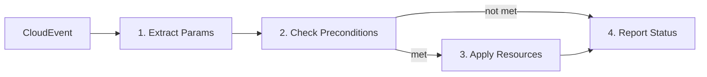
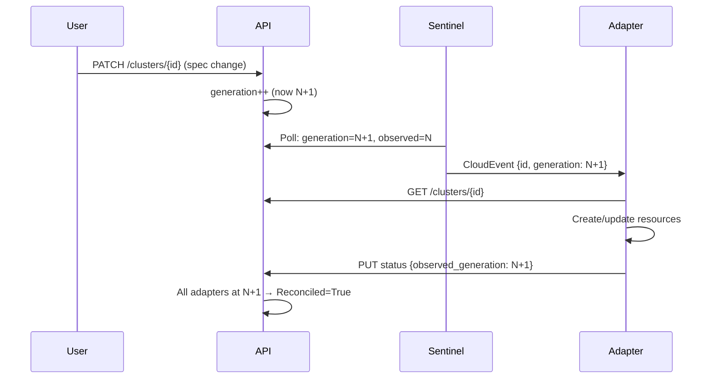
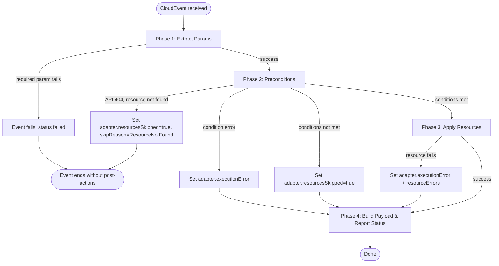
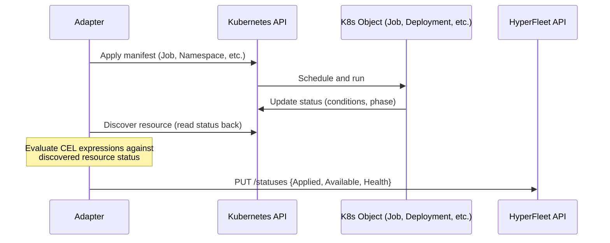

# HyperFleet Adapter Authoring Guide

> **Audience:** Adapter authors writing task configurations for HyperFleet resource lifecycle events.

> **Version:** This guide covers task configs that declare `schema_version: "2.0"`. If you maintain an unversioned (v1) task config, use the [v0.3.1 guide](https://github.com/openshift-hyperfleet/hyperfleet-adapter/blob/v0.3.1/docs/adapter-authoring-guide.md). [Appendix E](#appendix-e-concepts-changed-in-v2) summarizes what changed in v2. Some newer load-time rules apply to unversioned tasks as well and are not in the v0.3.1 guide: reserved param names and literal `apiVersion`/`kind` (see Appendix E).

---

## 1. Introduction

An **adapter** is an event-driven worker that reacts to lifecycle events of a HyperFleet resource kind (clusters, node pools, ...), creates Kubernetes resources, and reports status back to the HyperFleet API. You don't write Go code to build an adapter — you write **YAML configuration** that the adapter framework binary executes.

Your custom logic lives in the Kubernetes objects created by adapters, the status conditions of these Kubernetes objects will be reported back by the adapter to the HyperFleet API offering external visibility to the managed objects.

The framework is type-agnostic: the same task config structure works for any resource kind the HyperFleet API exposes. This guide's examples manage clusters, and parameters use generic names (`resourceId`, `resourceStatusPayload`) so they carry over to other kinds. What is kind-specific is the API path (`/clusters/{{ .resourceId }}`), the status endpoint and labels such as `hyperfleet.io/cluster-id`; change those together for another kind. [NodePool Adapters](#11-nodepool-adapters) shows a second kind, whose events also carry the parent cluster.

The flow of events goes like this:

customer updates a resource (for example a cluster) -> event -> adapter task -> k8s object performs work -> adapter reports status

### What you produce

Every adapter requires configuring 3 main elements:

| Concern |  Purpose |
|-------|---------|
| Adapter Config | Deployment settings: API client config, broker subscription, timeouts, retries, named stores and transports |
| Adapter Task Config | Business logic: what to extract, check, create, and report |
| Broker config |  Broker configuration: Configures broker system (pubsub, rabbitmq) |

The `AdapterConfig` is pretty straightforward, it defines the name of the adapter, the client configs to interact with the HyperFleet API and Kubernetes, and, for remote delivery, the named stores and transports. See the [Configuration Reference](configuration.md).

Your main authoring effort goes into the `AdapterTaskConfig` which configures the tasks to execute for every object changed by the customer

### When you need a new adapter

Create a new adapter when you need to:

- Provision a new type of infrastructure per cluster (namespace, RBAC, DNS, certificates)
- Validate cluster prerequisites before provisioning
- Manage resources on a remote target cluster through a remote transport

### Development workflow

```
Write task config → Dry-run locally → Inspect trace → Iterate → Deploy
```

The framework includes a **dry-run mode** that simulates the full execution pipeline without any infrastructure. You can validate your configuration before touching a real cluster.

---

## 2. Concepts

### Event-driven execution

When a cluster is created or updated, the **Sentinel** detects the change and publishes a lightweight CloudEvent to a message broker. Your adapter receives this event and executes a four-phase pipeline:


```mermaid
flowchart LR
    E[CloudEvent] --> P1[1. Extract Params]
    P1 --> P2[2. Check Preconditions]
    P2 -->|met| P3[3. Apply Resources]
    P2 -->|not met| P4
    P3 --> P4[4. Report Status]
```

Post-actions (phase 4) execute even when preconditions are not met or resources fail, so the adapter can report its state back to the API. Two cases end the event before phase 4 and send no report: a required param that cannot be resolved, and a resource-not-found response from a precondition `api_call` (for example, when the cluster no longer exists). Other precondition API errors, including a 404 from a broken endpoint, continue to post-actions so the adapter can report the failure (see [Error Handling](#7-error-handling)).

### Generation-based reconciliation

Every spec change increments a cluster's `generation` counter. Adapters report `observed_generation` with their status. When `generation > observed_generation`, the Sentinel publishes an event to trigger reconciliation.


```mermaid
sequenceDiagram
    participant User
    participant API
    participant Sentinel
    participant Adapter

    User->>API: PATCH /clusters/{id} (spec change)
    API->>API: generation++ (now N+1)
    Sentinel->>API: Poll: generation=N+1, observed=N
    Sentinel->>Adapter: CloudEvent {id, generation: N+1}
    Adapter->>API: GET /clusters/{id}
    Adapter->>Adapter: Create/update resources
    Adapter->>API: PUT status {observed_generation: N+1}
    API->>API: All adapters at N+1 → Reconciled=True
```

### Anemic events

Information carried by the events is the minimum to identify the changed object by the adapters.
For example for a NodePool, it will require both the Id of the NodePool and the Id of the Cluster it belongs.

The format of the event is CloudEvents.

```json
{
  "data": {
    "id": "abc123",
    "kind": "Cluster",
    "href": "/api/hyperfleet/v1/clusters/abc123",
    "generation": 5
  }
}
```

The adapter fetches the full resource from the API during the params phase.
This keeps the event schema stable and ensures the adapter always works with fresh data.

### Configuration languages

Three languages appear in adapter configs, each for a different purpose:

| Language | Syntax | Use for |
|----------|--------|---------|
| Go Templates | `{{ .resourceId }}` | String interpolation in URLs, manifest fields, direct values |
| CEL | `expression: "..."` | Logic evaluation in preconditions, status conditions, computed values |
| JSONPath | `field: "path"` | Simple field extraction from API responses |

**Rule of thumb:** Use Go Templates for inserting values into strings. Use CEL when you need conditionals, array filtering, or type-safe logic. Use `field:` for straightforward extraction from API responses.

---

## 3. Configuration Structure

### File skeleton

```yaml
schema_version: "2.0"  # Declares a v2 task. Required when a resource names a transport
params: []            # Phase 1: Extract variables from event and environment
preconditions: []     # Phase 2: Evaluate conditions against extracted params
resources: []         # Phase 3: Create/update Kubernetes resources
post:                 # Phase 4: Report status
  payloads: []        #   Build status JSON
  post_actions: []    #   Send status to API
```

### Execution flow and error handling


```mermaid
flowchart TD
    START([CloudEvent received]) --> PARAMS[Phase 1: Extract Params]
    PARAMS -->|required param fails| FAIL_PARAMS[Event fails: status failed]
    FAIL_PARAMS --> END([Event ends without post-actions])
    PARAMS -->|success| PRECOND[Phase 2: Preconditions]
    PRECOND -->|API 404, resource not found| NOTFOUND[Set adapter.resourcesSkipped=true, skipReason=ResourceNotFound]
    NOTFOUND --> END
    PRECOND -->|condition error| FAIL_PRECOND[Set adapter.executionError]
    FAIL_PRECOND --> POST
    PRECOND -->|conditions not met| SKIP[Set adapter.resourcesSkipped=true]
    SKIP --> POST
    PRECOND -->|conditions met| RESOURCES[Phase 3: Apply Resources]
    RESOURCES -->|resource fails| FAIL_RES[Set adapter.executionError + resourceErrors]
    FAIL_RES --> POST
    RESOURCES -->|success| POST
    POST[Phase 4: Build Payload & Report Status]
    POST --> DONE([Done])
```

The `adapter.*` context is populated automatically and available in your post-action CEL expressions:

| Variable | Type | Description |
|----------|------|-------------|
| `adapter.executionStatus` | string | `"success"` or `"failed"` |
| `adapter.resourcesSkipped` | bool | `true` if preconditions were not met, or if any resource's `lifecycle.create.when` evaluated to `false` |
| `adapter.skipReason` | string | Why resources were skipped |
| `adapter.executionError.phase` | string | Phase where the first error occurred |
| `adapter.executionError.step` | string | Specific step that first failed |
| `adapter.executionError.message` | string | First error details |
| `adapter.resourceErrors` | map | Per-resource errors from the resources phase (keyed by resource name) |
| `adapter.resourceErrors.<name>.phase` | string | Phase for that resource's error |
| `adapter.resourceErrors.<name>.step` | string | Resource name that failed |
| `adapter.resourceErrors.<name>.message` | string | Error details for that resource |

---

## 4. Parameter Extraction

Parameters are variables extracted from the CloudEvent, the environment, or the HyperFleet API. They become available as Go Template variables (`{{ .paramName }}`) and CEL variables throughout the rest of the config. Params are resolved in order, a param can reference the value of any param defined before it.

```yaml
params:
  # From the CloudEvent data
  - name: "resourceId"
    source: "event.id"
    type: "string"
    required: true

  - name: "generation"
    source: "event.generation"
    type: "int"
    required: true

  # From environment variables (set in Helm values or deployment)
  - name: "region"
    source: "env.REGION"
    type: "string"
    default: "us-east-1"

  # From the HyperFleet API — stores the full JSON response
  - name: "resourceStatus"
    source:
      api_call:
        method: "GET"
        url: "/api/hyperfleet/v1/clusters/{{ .resourceId }}"
        timeout: 10s
        retry_attempts: 3
        retry_backoff: "exponential"

  # Dot-notation derivation from an api_call param
  - name: "generationId"
    source: "resourceStatus.generation"

  # CEL expression over previously resolved params
  - name: "reconciledStatus"
    source:
      expression: |
        resourceStatus.status.conditions.filter(c, c.type == "Reconciled").size() > 0
          ? resourceStatus.status.conditions.filter(c, c.type == "Reconciled")[0].status
          : "False"
```

### Sources

| Prefix | Source | Example |
|--------|--------|---------|
| `event.` | CloudEvent data fields | `event.id`, `event.generation`, `event.kind` |
| `env.` | Environment variables | `env.REGION`, `env.NAMESPACE` |
| `config.` | Adapter deployment config fields | `config.adapter.name` |
| `<param>.` | Dot-notation into an earlier api_call param | `resourceStatus.generation`, `resourceStatus.status.phase` |
| `adapter.` | Built-in adapter metadata | `adapter.name`, `adapter.version` |

**Structured sources** - use a mapping value under `source:`:

`api_call` - fetches data from the HyperFleet API and stores the full JSON response as a `map` under the param name. The URL is a Go Template rendered against all params resolved so far.

```yaml
- name: "resourceStatus"
  source:
    api_call:
      method: "GET"
      url: "/api/hyperfleet/v1/clusters/{{ .resourceId }}"
      timeout: 10s
      retry_attempts: 3
      retry_backoff: "exponential"   # also: linear, constant
```

`expression` - evaluates a CEL expression over all params resolved so far. Useful for computed values and transformations.

```yaml
- name: "reconciledStatus"
  source:
    expression: |
      resourceStatus.status.conditions.filter(c, c.type == "Reconciled").size() > 0
        ? resourceStatus.status.conditions.filter(c, c.type == "Reconciled")[0].status
        : "False"
```

`file` - reads the content of a file from the local filesystem at reconciliation time. The file is read fresh on every event (not cached). Leading and trailing whitespace is trimmed by default (`trim: true`). Useful for service account tokens and mounted secrets that rotate.

```yaml
- name: "k8sToken"
  source:
    file:
      path: "/var/run/secrets/kubernetes.io/serviceaccount/token"
      trim: true   # default; set to false if whitespace is significant
```

File-sourced params can be referenced in `api_call` headers via Go Templates:

```yaml
- name: "resourceStatus"
  source:
    api_call:
      method: "GET"
      url: "/clusters/{{ .resourceId }}"
      headers:
        - name: "Authorization"
          value: "Bearer {{ .k8sToken }}"
```

> **Security:** File-sourced tokens rendered into headers carry credentials. Ensure request/response logging (including reverse proxies and service meshes) does not capture `Authorization` or other sensitive headers.

### Types and conversion

| Type | Accepts |
|------|---------|
| `string` | Any value (default) |
| `int`, `int64` | Integers, numeric strings, floats (truncated) |
| `float`, `float64` | Numeric values |
| `bool` | `true/false`, `yes/no`, `on/off`, `1/0` |

Type conversion applies to string and file sources. `api_call` params hold a structured map and `expression` params hold whatever the CEL expression returns — no conversion is applied.

If type conversion fails on a **required** param, execution stops. On an optional param, the `default` value is used.

### Common parameters

Most adapters need at least `resourceId` from the event and a `resourceStatus` api_call param to fetch the current resource state. From `resourceStatus`, derive any fields you need as separate params using dot-notation or expression sources.

---

## 5. Preconditions

Preconditions decide whether the Resources phase executes. They run sequentially and evaluate params resolved in the previous phase.


### Evaluating conditions

Two syntaxes are available:

**Structured conditions** — declarative, readable for simple checks:

```yaml
    conditions:
      - field: "reconciledStatus"
        operator: "equals"
        value: "False"
```

**CEL expression** — for complex logic:

```yaml
    expression: |
      reconciledStatus == "False" && resourceStatus.generation > 0
```

> **Scope:** Conditions see all resolved params and adapter metadata.

### Supported operators

| Operator | Description |
|----------|-------------|
| `equals` | Exact match |
| `notEquals` | Not equal |
| `in` | Value is in array |
| `notIn` | Value is not in array |
| `contains` | String contains substring |
| `greaterThan` | Numeric greater than |
| `lessThan` | Numeric less than |
| `exists` | Field exists (no value needed) |

These eight are the complete set; config validation rejects any other operator. For "does not exist", "greater than or equal" or "less than or equal", use a CEL `expression` instead (for example `!has(resourceStatus.deleted_time)` or `resourceStatus.generation >= 2`).

### Chaining preconditions

Preconditions execute in order. All params (including those from api_call sources) are available to every precondition's conditions and expression:

```yaml
params:
  - name: "resourceId"
    source: "event.id"
  - name: "resourceStatus"
    source:
      api_call:
        method: "GET"
        url: "/api/hyperfleet/v1/clusters/{{ .resourceId }}"
  - name: "resourceName"
    source: "resourceStatus.name"
  - name: "statusesData"
    source:
      api_call:
        method: "GET"
        url: "/api/hyperfleet/v1/clusters/{{ .resourceId }}/statuses"
  - name: "lzReconciled"
    source:
      expression: |
        statusesData.items.filter(i, i.adapter == "landing-zone")[0].data.namespace.status

preconditions:
  - name: "resourceReady"
    conditions:
      - field: "lzReconciled"
        operator: "equals"
        value: "Active"
```

When a condition is **not met**, the adapter skips the resources phase but still runs post-actions. The `adapter.resourcesSkipped` flag is set to `true` and `adapter.skipReason` describes why.

### Time-based stability preconditions

#### Why use time-based preconditions?

Adapter preconditions typically need to handle two scenarios:

1. **Initial deployment** — Deploy resources when the cluster is NOT Reconciled
2. **Self-healing** — Detect and recreate accidentally deleted resources when the cluster IS Reconciled

A condition-only precondition (e.g., "only run when cluster is NOT Reconciled") handles scenario 1 but breaks scenario 2:

```yaml
# Condition-only pattern - INCOMPLETE
params:
  - name: "resourceId"
    source: "event.id"
  - name: "resourceStatus"
    source:
      api_call:
        method: "GET"
        url: "/api/hyperfleet/v1/clusters/{{ .resourceId }}"
  - name: "reconciledStatus"
    source:
      expression: |
        resourceStatus.status.conditions.filter(c, c.type == "Reconciled").size() > 0
          ? resourceStatus.status.conditions.filter(c, c.type == "Reconciled")[0].status
          : "False"

preconditions:
  - name: "checkResource"
    conditions:
      - field: "reconciledStatus"
        operator: "equals"
        value: "False"   # Only runs resource phase when NOT Reconciled
```

**Problem:** If a resource is accidentally deleted while the cluster is Reconciled, the adapter skips the resource operation phase because the precondition is `False`. The adapter still runs and reports status, but it cannot detect or recreate the deleted resource because it never executes the resource phase.

**Solution:** Add a time-based stability check to enable both scenarios:

- Run resource phase when cluster is **NOT Reconciled**
- Run resource phase when cluster is **Reconciled AND stable for >5 minutes** (periodic self-healing)

#### Understanding `last_transition_time` vs `last_updated_time`

To implement time-based stability checks, you need to know how long a cluster has been in its current state. Each condition provides two timestamp fields:

| Field | Updates when | Use for |
|-------|-------------|---------|
| **`last_transition_time`** | Condition status **changes** (True→False or False→True) | **Stability windows** — "cluster has been Reconciled for N minutes" |
| **`last_updated_time`** | Adapter **reports status** (every PUT, even if unchanged) | **Liveness checks** — "adapter reported recently" |

**Critical:** For stability windows, always use `last_transition_time`. The `last_updated_time` field has special aggregation behavior that makes it unsuitable for measuring state duration.

#### Correct pattern: Time-based stability precondition

```yaml
params:
  - name: "resourceId"
    source: "event.id"
  - name: "resourceStatus"
    source:
      api_call:
        method: "GET"
        url: "/api/hyperfleet/v1/clusters/{{ .resourceId }}"
  - name: "resourceNotReconciled"
    source:
      expression: |
        resourceStatus.status.conditions.filter(c, c.type == "Reconciled").size() > 0
          ? resourceStatus.status.conditions.filter(c, c.type == "Reconciled")[0].status != "True"
          : true
  - name: "resourceReconciledTTL"
    source:
      expression: |
        (timestamp(now()) - timestamp(
          resourceStatus.status.conditions.filter(c, c.type == "Reconciled").size() > 0
            ? resourceStatus.status.conditions.filter(c, c.type == "Reconciled")[0].last_transition_time
            : now()
        )).getSeconds() > 300

preconditions:
  - name: "validationCheck"
    # Precondition passes if cluster is NOT Reconciled OR if cluster is Reconciled and stable for >300 seconds since last transition (enables self-healing)
    expression: |
      resourceNotReconciled || resourceReconciledTTL
```

**What this does:**

- `resourceNotReconciled` → Captures whether the cluster is NOT Reconciled (true when Reconciled condition is missing or not "True")
- `resourceReconciledTTL` → Captures whether the cluster has been Reconciled for >5 minutes (300 seconds) since the last status transition
- `validationCheck` → Evaluates both conditions: run resource phase when cluster is NOT Reconciled OR when cluster has been Reconciled and stable for >5 minutes (self-healing)

**Deprecated compatibility example** using domain-specific CEL helpers (existing configs only):

Direct `preconditions[].api_call` remains accepted but triggers a deprecation warning. For new tasks, put the API call in `params[].source.api_call` and evaluate the fetched values in a precondition; see [Parameter Extraction](#4-parameter-extraction).

```yaml
preconditions:
  - name: "checkResourceState"
    api_call:
      method: "GET"
      url: "/api/hyperfleet/v1/clusters/{{ .resourceId }}"
    capture:
      - name: "resourceNotReconciled"
        expression: |
          conditionStatus(status.conditions, "Reconciled") != "True"
      - name: "resourceReconciledTTL"
        expression: |
          stableFor(status.conditions, "Reconciled", 300)

  - name: "validationCheck"
    expression: |
      resourceNotReconciled || resourceReconciledTTL
```

**Important notes:**

- The `now()` function returns the current time in RFC3339 format as a string.
- Use `timestamp()` to convert RFC3339 strings to timestamp types for arithmetic operations.
- This pattern enables both initial deployment and periodic self-healing checks.

---

## 6. Resources

Resources define the Kubernetes objects your adapter delivers. Each entry is a plain Kubernetes manifest plus a `discovery` that reads the live object back. A resource can also name a [transport](#transports) that decides where the manifest goes, and a `lifecycle` that gates its creation and deletion. Resources are processed **sequentially in the order listed**; [Ordering resources](#ordering-resources) describes the model.

**Important**: add the annotation `hyperfleet.io/generation: "{{ .generation }}"` to every manifest. The adapter compares it with the annotation on the live object to decide between create, update and skip, and a remote transport rejects a manifest that does not carry it.

### Resource fields

| Field | Required | Purpose |
|-------|----------|---------|
| `name` | yes | The resource's alias in CEL: `resources.<name>` and `resource_states.<name>`. Starts with a lowercase letter and contains only letters, numbers and underscores |
| `manifest` | yes | The Kubernetes object to deliver: an inline mapping, an inline block scalar, or a `ref` to a file. `apiVersion` and `kind` must be literal values, not templates, because the loader reads them without rendering |
| `discovery` | yes | How to read the live object back: `by_name` or `by_selectors` |
| `transport` | no | Name of a transport. Omit it to apply to the cluster the adapter is configured for (see [Transports](#transports)) |
| `lifecycle` | no | `create.when` and `delete.when` gates (see [Ordering resources](#ordering-resources)) |
| `recreate_on_change` | no | Local transport only; a remote resource that sets it fails to load. Delete and recreate the object instead of updating it when its generation changes |

### Inline manifests

The snippets in this section omit `transport`, so the resources are applied to the local cluster.

```yaml
resources:
  - name: "namespace"
    manifest:
      apiVersion: v1
      kind: Namespace
      metadata:
        name: "{{ .resourceId }}"
        labels:
          hyperfleet.io/cluster-id: "{{ .resourceId }}"
          hyperfleet.io/managed-by: "{{ .adapter.name }}"
          hyperfleet.io/resource-type: "namespace"
        annotations:
          hyperfleet.io/generation: "{{ .generation }}"
    discovery:
      by_name: "{{ .resourceId }}"
```

Inline manifests are parsed as YAML before template rendering, so they support `{{ .var }}` substitution in values but **not** structural directives (`{{ if }}`, `{{ range }}`). To use structural Go templates inline, use a YAML block scalar (`|`):

```yaml
resources:
  - name: "configMap"
    manifest: |
      apiVersion: v1
      kind: ConfigMap
      metadata:
        name: "{{ .resourceId }}-config"
        annotations:
          hyperfleet.io/generation: "{{ .generation }}"
      data:
        cluster_id: "{{ .resourceId }}"
      {{ if eq .platformType "gcp" }}
        platform_tier: "cloud"
      {{ else }}
        platform_tier: "onprem"
      {{ end }}
    discovery:
      namespace: "default"
      by_name: "{{ .resourceId }}-config"
```

The `|` block scalar tells YAML to treat the content as a raw string, which preserves Go template directives for rendering at execution time.

Keep `apiVersion` and `kind` out of conditionals. Each must appear once at the top level of the manifest, so declaring them in both branches of an `{{ if }}`/`{{ else }}` fails at load time with `apiVersion is set more than once`, even when both branches use the same values. Conditionals in other fields are fine.

### External manifest files

For larger manifests, reference an external YAML file:

```yaml
resources:
  - name: "validationJob"
    manifest:
      ref: "job.yaml"
    discovery:
      namespace: "{{ .resourceId }}"
      by_selectors:
        label_selector:
          hyperfleet.io/cluster-id: "{{ .resourceId }}"
          hyperfleet.io/resource-type: "job"
```

A relative `ref` resolves against the directory of the task config file, and the resolved path must stay inside that directory. In a deployment, mount the manifest file next to the task config, for example from the same ConfigMap.

The referenced file is a Go template and has access to all resolved params.

### Resource operations

The adapter decides the operation for each resource from the generation annotation:

| Operation | When | Behavior |
|-----------|------|----------|
| `create` | The resource does not exist | Apply the manifest |
| `update` | The resource exists and its generation differs from the manifest's | Apply the changed manifest |
| `skip` | The resource exists and its generation is unchanged, **or** the resource does not exist and `lifecycle.create.when` evaluates to `false` | No-op; the latter case also sets `adapter.resourcesSkipped` to `true` |
| `recreate` | The generation differs and `recreate_on_change: true` is set (local transport only) | Delete then create |
| `delete` | `lifecycle.delete.when` evaluates to `true` | Delete the resource; remaining resources are still processed |

### Discovery

After applying a resource, the adapter **discovers** it: it reads the whole live object back. The object is then available in CEL as `resources.<name>`, with its `metadata`, `spec`, `status` and every other field, exactly as the cluster returns it. Its discovery outcome is available as `resource_states.<name>`.

Two discovery modes. Set exactly one of `by_name` and `by_selectors`:

```yaml
# By name (direct lookup)
discovery:
  by_name: "{{ .resourceId }}"

# By label selector
discovery:
  namespace: "{{ .resourceId }}"       # omit for cluster-scoped kinds
  by_selectors:
    label_selector:
      hyperfleet.io/cluster-id: "{{ .resourceId }}"
      hyperfleet.io/resource-type: "namespace"
```

When a selector matches several objects, the one with the highest `hyperfleet.io/generation` annotation is used.

Read the discovered object directly. There is no copying or promotion of fields:

```cel
resources.?namespace.?status.?phase.orValue("")
resources.?validationJob.?status.?conditions.orValue([]).exists(c, c.type == "Complete" && c.status == "True")
```

When the Resources phase runs and any resource configures `lifecycle.create` or `lifecycle.delete`, the executor pre-discovers all resources before the apply loop. A resource may therefore have a discovery state and object in context even if its apply is not reached; a resource that was not discovered in the pass has no state:

| `resource_states.<name>` | Meaning | `resources.<name>` |
|--------------------------|---------|--------------------|
| `present` | The object was read back | The object |
| `confirmed_deleted` | The object was not found, and nothing suggests it is still on its way | Absent |
| `unsynced` | The read-back cannot say yet whether the object exists (remote transports only) | The last known object, or an empty placeholder when there is none |

`confirmed_deleted` means "not found". It is also the state of a resource that was never created. Use `resource_states` for presence decisions: `resources.?X.hasValue()` is `true` for the empty placeholder of an `unsynced` resource, so it is not a presence check.

### Labeling conventions

Always label your resources for discovery and traceability:

| Label | Purpose |
|-------|---------|
| `hyperfleet.io/cluster-id` | Associate resource with a cluster |
| `hyperfleet.io/managed-by` | Adapter that owns this resource |
| `hyperfleet.io/resource-type` | Resource category for discovery |
| `hyperfleet.io/generation` | Generation that created/updated this resource (annotation) |

### Transports

A resource's `transport` selects how its manifest is delivered and read back. The task config only names a transport. The transport itself is declared in the deployment config, and naming one requires `schema_version: "2.0"` in the task config.

| Transport | Declared | Delivery |
|-----------|----------|----------|
| `kubernetes` | Implicit. The default when `transport` is omitted. The name is reserved for the local transport | Applied directly to the cluster the adapter is configured for |
| A remote name, for example `remote-primary` | In the deployment config under `transports`, with `type: remote`, a `store`, a `target_cluster` and `resource_plurals` | Written to a store. The remote cluster side applies it and mirrors the live object back, which discovery reads |

Both transports use the same resource fields. Only `transport` selects between them. The behavior differences are listed under [Remote transports](#remote-transports).

#### Local Kubernetes

The default. The adapter applies the manifest directly through the Kubernetes API. Set the credentials with `clients.kubernetes.kube_config_path` in the deployment config, or leave it empty to use the in-cluster configuration of the cluster the adapter runs in.

```yaml
resources:
  - name: "myResource"
    # transport omitted: local Kubernetes. "transport: kubernetes" means the same.
    manifest:
      # ... standard K8s manifest
```

#### Remote transports

A remote resource names a transport declared under `transports`:

```yaml
resources:
  - name: "remoteConfig"
    transport: remote-primary
    manifest:
      apiVersion: v1
      kind: ConfigMap
      metadata:
        name: "{{ .resourceId }}-config"
        namespace: "{{ .resourceId }}-remote"
        annotations:
          hyperfleet.io/generation: "{{ .generation }}"
      data:
        cluster_id: "{{ .resourceId }}"
    discovery:
      namespace: "{{ .resourceId }}-remote"
      by_name: "{{ .resourceId }}-config"
```

The deployment-side fields (`store`, `target_cluster`, `resource_plurals`) and what the operator must provision are in [Configuration Reference: Transports and stores](configuration.md#transports-and-stores).

Discovery returns the **full mirrored object**, status and all, in `resources.<name>`, with the same shape a local object has. The mirror is eventually consistent and can be stale; see [the contract below](#the-eventual-consistency-contract-for-remote-reads).

**Constraints the loader enforces.** A violation fails at load time. `hyperfleet-adapter config-dump` reports it without a broker or a cluster (see [Testing and Validation](#12-testing-and-validation)):

- Every manifest kind needs an entry in the transport's `resource_plurals`.
- `lifecycle.delete` needs `discovery.by_name`. A selector cannot identify which object to delete.
- `target_cluster` may use only built-in variables, params and precondition captures.
- The transport name must exist: `kubernetes` or a name declared under `transports`.
- `recreate_on_change` is rejected. It works only on the local transport.

The generation annotation is checked when the resource is applied. A manifest without a valid `hyperfleet.io/generation` annotation fails the resources phase.

**Behavior that differs from the local transport:**

- `propagationPolicy` has no effect on a remote delete.
- A successful apply means the write was accepted. It does not mean the remote cluster has converged. Dependent resources can need another event before their gates open.

### The eventual-consistency contract for remote reads

Remote reads are **eventually consistent**. The object you read is not a live query against the target cluster. It is the last state the remote side mirrored back. This section states what you can rely on when writing CEL against a remote resource.

#### Reads return the last mirrored state, not a live query

When discovery reads a remote resource, it returns the object as of the last time the remote side mirrored it, not the state at the instant of the read. There is a lag between the moment the adapter writes the requested manifest and the moment the mirror reflects the remote side's work. During that window, discovery returns the *previous* mirrored state, or reports `unsynced` if the resource has never been mirrored.

Treat every remote read as **potentially stale**. Do not assume a change you just applied is visible on the next line of CEL.

#### Staleness is visible through a generation mismatch

The `hyperfleet.io/generation` annotation is written once on the manifest and **round-trips through the mirror** into the mirrored object. This is the staleness signal:

- When the generation on the mirrored object **matches** the generation you applied, the mirror is current. The remote side has caught up with your request.
- When they **differ**, the mirror is stale. The remote side has not yet reconciled your latest request.

On a mismatch the adapter does not block on a live read. It reports the mirrored state it has, and the next event reads it again. Design your status conditions to say *"not converged yet"* on a mismatch instead of treating it as a failure.

The adapter validates the annotation and compares it with the last request it wrote before writing again. What you observe:

- The same generation as the last write causes no write (`skip`), even if the mirror still shows an older generation.
- A lower generation than the last write, or than the mirror, is refused (`skip`, with a reason that starts `stale generation`). An old event cannot roll a resource back.
- A higher generation is written (`update`). A resource that was never written is a `create`.
- If the mirror is ahead of the last write, an incoming generation equal to the mirror's is written instead of refused.
- The adapter re-establishes the read-back of a resource on every pass, including a skipped one. A read-back removed from outside returns on the next event.

```mermaid
sequenceDiagram
    participant Adapter
    participant Store
    participant Remote as Remote cluster side
    participant Mirror as Mirrored state

    Adapter->>Store: write requested manifest (generation N+1)
    Adapter->>Mirror: discover → still shows generation N
    Note over Adapter: generation mismatch → report not converged; do not block
    Remote->>Store: reconcile the request
    Remote->>Mirror: mirror live object (generation N+1)
    Note over Adapter: next event: mirror matches → converged
```

#### Not-synced-yet and not-found are distinct outcomes

Three states are distinguishable in `resource_states`, and they mean different things:

| State | Meaning | What it tells the author |
|-------|---------|--------------------------|
| **Unsynced** | The read-back has not synced yet, or a write or delete is still in flight, so a missing or not-found mirror is not conclusive | Transient. Do not treat it as confirmed absence |
| **Present** | The mirror holds an object | Read its fields. Check the mirrored generation before trusting freshness |
| **Confirmed deleted** | No write or delete is in flight and the mirror reports not found, or nothing was ever requested for the target. After this resource's own delete step in the pass, the remote side's delete confirmation also counts, even while the mirror still shows the object. Discovery alone never reports `confirmed_deleted` while the mirror holds the object | The object is absent and no work is pending. It does not prove the object once existed |

The critical distinction is **unsynced vs. confirmed deleted**: an absent mirror ("I have not seen it yet") is not the same as a confirmed-gone resource ("it does not exist"). Reporting `Available=False` because a mirror has not synced is a bug, because the resource may be seconds from appearing. A confirmed deletion is a separate terminal outcome.

A selector (`by_selectors`) result comes from mirrors only. It is `unsynced` while an unsynced mirror remains in the selector's scope, and an empty result is otherwise `confirmed_deleted`. A selector cannot see a write that has not reached a mirror yet, so use `discovery.by_name` for resources that gates depend on.

#### The same CEL works on both transports

Local discovery produces only `present` or `confirmed_deleted`. A remote transport can also produce `unsynced`. CEL written against `resource_states` and full objects therefore behaves the same on both transports. On a local resource, the `unsynced` branch never fires.

#### Writing CEL against remote reads

Use `resource_states` to distinguish a present mirror from an unsynced or confirmed-deleted resource. Read object fields only after discovery reports `present`:

```cel
// The mirror contains an object and it reflects this generation
resource_states.?remoteConfig.orValue("") == "present"
  && resources.remoteConfig.?metadata.?annotations[?"hyperfleet.io/generation"].orValue("") == string(generation)

// Confirmed absence is different from an unavailable mirror
resource_states.?remoteConfig.orValue("") == "confirmed_deleted"

// Unsynced is transient; do not report it as confirmed failure or deletion
resource_states.?remoteConfig.orValue("") == "unsynced"
```

`resources.?remoteConfig.hasValue()` reports whether the alias has a non-null value in the CEL context. It is `true` for a present object and for the empty placeholder of an `unsynced` resource. It is `false` for a confirmed deletion or an unprocessed resource. Use `resource_states` for presence and lifecycle decisions.

Guidance for status conditions (see also [Remote-backed conditions](#remote-backed-conditions)):

- Default a remote-backed condition to `"Unknown"` while `resource_states.X` is `unsynced` or missing. It is not evidence of failure.
- Only trust a mirrored object's status once its `hyperfleet.io/generation` matches the `generation` you applied. Otherwise you are reading a stale snapshot.
- Reserve `"False"` for a confirmed-gone resource or an actual bad status on a current mirror, never for staleness.

> **See also:** [ADR-0015: Eventual consistency for the read path](https://github.com/openshift-hyperfleet/architecture/blob/main/hyperfleet/adrs/0015-eventual-consistency-for-read-path.md) for general background on the API read path (transaction-free GET/LIST reads and polling mitigation). It does not define the remote mirror or the generation matching described above. Reconciliation scheduling is owned by the surrounding event/reconciliation system.

### Ordering resources

The adapter has no `order` or `depends_on` field. Ordering is a small model made of list position and `lifecycle.*.when` gates. The decision behind it is recorded in the [DSL v2 resource ordering spike](https://github.com/openshift-hyperfleet/architecture/blob/main/hyperfleet/docs/dsl-v2-resource-ordering-spike.md).

**The model:**

- **Apply runs in list order and fails fast.** The first failed apply stops the resources phase. Resources applied before it stay applied, and later ones are not processed. Post-actions still run, with `adapter.executionStatus` set to `"failed"`.
- **Delete is best-effort.** Every delete is attempted, even after one fails. All errors are collected and reported together.
- **Every resource is pre-discovered before any `when` is evaluated.** Gates can therefore read the state of a sibling listed later in the same list. Pre-discovery runs when any resource in the list has a `lifecycle` block. A discovery error that is neither "not found" nor "not synced" fails the phase instead of being read as absence.
- **`lifecycle.create.when` gates creation only.** It is evaluated for a resource that is not found, and ignored once the resource exists. A resource whose read-back is `unsynced` counts as not found.
- **`lifecycle.delete.when` gates deletion.** It is evaluated on every pass. A resource whose delete gate is `false` is applied normally, **even while the cluster is being deleted**.
- **A gate is evaluated in a fixed order for each resource:** the create gate first (only when the resource is not found), then the delete gate, then the apply.
- **There is no checkpoint.** Every event is a full pass from the top, and every `when` is evaluated again from scratch. A resource deferred in one pass resolves on a later pass, once the state of its dependency changes.
- **Ordering guarantees attempts, not convergence.** A gate sees the state read at the start of the pass, plus whatever earlier resources in the list changed during it. On a remote transport a dependent can need another event before its gate opens.

#### Conditional creation (lifecycle.create)

Resources can gate their **initial creation** on a CEL expression using the `lifecycle.create` block. This lets you apply a resource only once some runtime condition holds (a feature flag param, a sibling resource's discovered state, an event payload field) without blocking the rest of the resources phase. Preconditions, by contrast, are all-or-nothing for the entire phase.

```yaml
resources:
  - name: "optionalFeatureConfig"
    manifest:
      # ...
    discovery:                              # required on every resource
      by_name: "{{ .resourceId }}-feature"
    lifecycle:
      create: # optional block; when present, `when` is required
        when:
          expression: "enableOptionalFeature"
```

Here `enableOptionalFeature` is a param (params are top-level CEL names, not `params.<name>`).

**Requirements:**

- `lifecycle.create` itself is optional. When present, `when.expression` is required and must be a valid CEL expression. Config validation rejects a `lifecycle.create` block with a missing or empty `when.expression`.
- `discovery` must be configured on the same resource. Without it the executor cannot tell whether the resource already exists.

**Behavior:**

- **Resource not found**: the `when` expression is evaluated. `false` skips creation (operation `skip`, `adapter.resourcesSkipped` set to `true`). `true` proceeds with the normal create flow. Resources with no `lifecycle.create` are always created normally.
- **Resource already exists**: the `when` expression is **ignored** and the resource is applied normally (update flow). This makes `lifecycle.create.when` a one-time gate on initial creation, not a recurring condition.
- **CEL errors**: an expression that does not compile is rejected when the config loads. An expression that compiles but fails at runtime, for example because it reads a param that was never set, counts as `false`: `lifecycle.create.when` skips the resource and `lifecycle.delete.when` applies it normally. Nothing is logged at the default level, so guard optional values with `.?`/`orValue()` and derive booleans such as `is_deleting` with an `expression` source.

**Skipping without blocking siblings.** The skip is scoped to a single resource, so other resources in the list still execute. Gate a child on its parent being present:

```yaml
resources:
  - name: "parent"
    # ... no lifecycle.create: always applied

  - name: "child"
    # ...
    discovery:
      by_name: "{{ .resourceId }}-child"
    lifecycle:
      create:
        when:
          # Create the child only once the parent has been read back as present
          expression: 'resource_states.?parent.orValue("") == "present"'
```

Use `resource_states`, not `resources.?parent.hasValue()`. The `hasValue()` form is also `true` for the placeholder of an unsynced remote parent, so the child would be created before its parent is mirrored.

**Create gates during deletion.** When the cluster is being deleted, a resource that is already gone is "not found", so its create gate is evaluated before its delete gate. A `false` create gate skips the resource and sets `adapter.resourcesSkipped`. The standard `Health` condition reads that flag, and so does the `Finalized` boilerplate in [Appendix A](#appendix-a-cel-quick-reference). `Health` reports `False` and `Finalized` cannot become `True`. Let the create gate pass during deletion and let the delete gate handle the resource:

```yaml
        when:
          expression: 'is_deleting || resource_states.?parent.orValue("") == "present"'
```

With `is_deleting` true, `lifecycle.delete.when` (also `is_deleting`) takes over and reports the resource as already deleted. The apply never runs. This form is safe only when the resource's `lifecycle.delete.when` is true whenever `is_deleting` is true. If the delete gate also waits on something else, as a parent's gate waits for its child, the create gate passes while the delete gate is false, and the resource is applied again during deletion. The [worked example](#worked-example-two-resources-remote-and-local) uses this form.

**Reporting skipped resources in post-actions.** `adapter.resourcesSkipped` is shared with the precondition-level skip flag, so a post-action `when` gate can react the same way regardless of which phase produced the skip:

```cel
adapter.?resourcesSkipped.orValue(false)
  ? "Resources skipped: " + adapter.?skipReason.orValue("unknown")
  : "All resources processed successfully"
```

#### Conditional deletion (lifecycle.delete)

Resources can be conditionally deleted using the `lifecycle.delete` block. This lets the adapter clean up managed resources when a deletion event occurs, with CEL expressions controlling the deletion order between dependent resources.

```yaml
resources:
  - name: "namespace"
    manifest:
      # ...
    discovery:                    # required: needed to locate the resource for deletion
      by_name: "{{ .resourceId }}"
    lifecycle:
      delete:
        propagationPolicy: Background   # optional: Background (default), Foreground, Orphan
        when:
          expression: "is_deleting"     # required: CEL expression evaluated on every pass
```

**Requirements:**

- `discovery` must be configured on the same resource. Without it the executor cannot locate the resource to delete. For a remote transport it must be `by_name`.
- `when.expression` is required. The resource is deleted only when the expression evaluates to `true`.

**The is_deleting pattern.** The standard way to detect a pending deletion is to derive a boolean from the cluster API response in the params phase using an `expression` source:

```yaml
params:
  - name: "resourceStatus"
    source:
      api_call:
        method: "GET"
        url: "/api/hyperfleet/v1/clusters/{{ .resourceId }}"
  - name: "is_deleting"
    source:
      expression: "resourceStatus.?deleted_time.hasValue()"
```

Then reference `is_deleting` in `lifecycle.delete.when.expression`.

> **Why not `source: "resourceStatus.deleted_time"`?** While the resource is not being deleted the field is absent, and an optional dot-notation source then leaves the param unset without logging anything. Every CEL expression that reads `is_deleting` then fails at runtime: a lifecycle gate counts it as `false`, and payload expressions log `cel evaluation failed`. The `expression` source with `hasValue()` returns a real `false`.

**Dependency ordering.** When resources must be deleted in a specific order, gate the parent's delete on the child being confirmed gone with `resource_states.?X.orValue("") == "confirmed_deleted"`. This also keeps an unsynced remote mirror from looking like confirmed absence:

```yaml
resources:
  - name: "namespaceResource"       # parent, listed first so it is applied first
    # ...
    lifecycle:
      delete:
        when:
          # Delete the namespace only once configMapResource is confirmed gone
          expression: 'is_deleting && resource_states.?configMapResource.orValue("") == "confirmed_deleted"'

  - name: "configMapResource"       # child
    # ...
    lifecycle:
      delete:
        when:
          expression: "is_deleting"
```

How this plays out across events when the parent is listed first:

```text
Event 1 (is_deleting=true):
  → Delete configMapResource                   (its gate is true)
  → namespaceResource gate is false             (configMapResource was present when the pass began)

Event 2 (configMapResource gone):
  → resource_states.configMapResource == "confirmed_deleted"
  → Delete namespaceResource                    (its gate is true)
```

Gates read the state recorded so far. A parent listed *after* its child sees the child's delete result in the same pass, so a local delete can cascade within one event. A parent listed *before* its child sees the child's state from the start of the pass and waits for the next event, whatever the transport.

> **Note**: `resources.?X.hasValue()` is not a presence check, because it is also `true` for an unsynced resource's empty placeholder. For lifecycle ordering across local and remote resources, use `resource_states.?X.orValue("") == "confirmed_deleted"`. Do not use `has(resources.X)` either: like `hasValue()`, it is `true` for the empty placeholder of an unsynced remote resource. Do not use `== null`, which fails if the key was never added because the pass stopped early.

**Post-delete context.** After deleting a resource, the executor updates `resources.X` and `resource_states.X`. A local delete is checked by reading the object again. A remote delete is confirmed by the remote side instead, because the mirror can lag the deletion:

| Situation after the delete request | `resources.X` | `resource_states.X` | Effect on dependents |
|---|---|---|---|
| Local: not found on re-read | absent | `confirmed_deleted` | Dependents later in the list can proceed in the same pass |
| Local: still present (finalizers) | the object | `present` | Dependents wait for the next event |
| Remote: delete confirmed by the remote side and cleanup succeeded | absent | `confirmed_deleted` | Dependents later in the list can proceed in the same pass |
| Remote: delete not yet confirmed, mirror still shows the object | the mirrored object | `present` | Dependents wait |
| Remote: delete not yet confirmed and no mirrored object | empty placeholder | `unsynced` | Dependents wait |
| Remote: delete confirmed but cleanup of the adapter's records failed | last mirrored object, or empty placeholder | `unsynced` | Dependents wait; execution fails |

A cleanup failure does not retract the remote side's confirmation, but it keeps dependent gates closed in that pass. Once a confirmed deletion has been cleaned up, later events find nothing recorded for the target and report `confirmed_deleted` again.

**propagationPolicy.** Controls how Kubernetes removes dependent objects. It has no effect on remote transports.

| Value | Behavior |
|---|---|
| `Background` (default) | Kubernetes GC runs asynchronously after the resource is deleted |
| `Foreground` | API call blocks until all dependents are gone before removing the owner |
| `Orphan` | Owner is deleted immediately; dependents are left behind (no GC) |

#### Edge cases

- **Partial failure mid-list.** Apply stops at the first failure and the earlier resources stay applied. There is no rollback. Delete failures do not stop the pass; see [Partial delete failures](#partial-delete-failures).
- **Retry.** There is no resume. The next event runs the whole list again. Resources whose generation is unchanged are skipped, so a retry repeats the work only where the previous pass did not finish it.
- **Different transports in one adapter.** Each resource is routed by its own `transport`, so one list can mix local and remote resources. Gates read `resource_states` the same way for both. They differ only in speed: a local delete is confirmed within the pass, while a remote delete usually takes further events, so dependents of a remote resource wait longer.
- **Delete symmetry.** Applying parents first and deleting children first is a convention, not something the adapter enforces. You express it with the gates above. Parents-first lists, as in the worked example below, delete in two events. A children-first list with a `lifecycle.create` gate on the children lets a local delete cascade in one event.

---

## Worked Example: Two Resources, Remote and Local

This example delivers a Namespace and a ConfigMap through a remote transport, orders them, and reports tri-state conditions. It then shows the same task on the local transport as a two-line change. It follows the shipped [`charts/examples/remote-two-resources`](https://github.com/openshift-hyperfleet/hyperfleet-adapter/tree/main/charts/examples/remote-two-resources) example with three differences: the manifests are inline, the condition expressions are trimmed, and the ConfigMap has a create gate that the shipped file does not have. Open the shipped task config for the full condition expressions.

### Deployment config

The deployment config declares one store and one remote transport. `target_cluster` is rendered for every event, so each HyperFleet cluster is its own target. `resource_plurals` lists both kinds the task delivers.

```yaml
adapter:
  name: two-resources

clients:
  hyperfleet_api:
    base_url: http://hyperfleet-api:8000
    timeout: 10s
  broker:
    subscription_id: two-resources
    topic: hyperfleet-clusters
  kubernetes:
    api_version: v1

# Remote delivery needs a store and a remote cluster side, deployed separately.
stores:
  remote-store:
    type: redis
    url: rediss://CHANGE_ME:6379
transports:
  remote-primary:
    type: remote
    store: remote-store
    target_cluster: "{{ .resourceId }}"
    resource_plurals:
      "v1/Namespace": namespaces
      "v1/ConfigMap": configmaps
```

An operator has to provision the store and the remote cluster side; see [Configuration Reference: Transports and stores](configuration.md#transports-and-stores).

### Task config

```yaml
schema_version: "2.0"

params:
  - name: resourceId
    source: event.id
    type: string
    required: true
  - name: resourceStatus
    source:
      api_call:
        method: GET
        url: /clusters/{{ .resourceId }}
        timeout: 10s
  - name: generation
    source: resourceStatus.generation
    type: int
  - name: is_deleting
    source:
      expression: "resourceStatus.?deleted_time.hasValue()"

resources:
  # Applied first. On delete it waits until the ConfigMap is confirmed gone.
  - name: namespace
    transport: remote-primary
    manifest:
      apiVersion: v1
      kind: Namespace
      metadata:
        name: "{{ .resourceId }}-remote"
        labels:
          hyperfleet.io/cluster-id: "{{ .resourceId }}"
        annotations:
          hyperfleet.io/generation: "{{ .generation }}"
    discovery:
      by_name: "{{ .resourceId }}-remote"
    lifecycle:
      delete:
        when:
          expression: |
            is_deleting && resource_states.?configMap.orValue("") == "confirmed_deleted"

  # Applied second, and only once the Namespace has been read back as present.
  # Deleted first.
  - name: configMap
    transport: remote-primary
    manifest:
      apiVersion: v1
      kind: ConfigMap
      metadata:
        name: cluster-config
        namespace: "{{ .resourceId }}-remote"
        labels:
          hyperfleet.io/cluster-id: "{{ .resourceId }}"
        annotations:
          hyperfleet.io/generation: "{{ .generation }}"
      data:
        cluster_id: "{{ .resourceId }}"
    discovery:
      namespace: "{{ .resourceId }}-remote"
      by_name: cluster-config
    lifecycle:
      create:
        when:
          expression: 'is_deleting || resource_states.?namespace.orValue("") == "present"'
      delete:
        when:
          expression: "is_deleting"
```

How the model applies:

- **Apply order.** `namespace` is first in the list, so it is applied first. `configMap` is applied second.
- **Create gate.** The ConfigMap is created only once `resource_states.namespace` is `present`. On a remote transport that waits for the Namespace to be mirrored back, which can take another event. The `is_deleting ||` part keeps the gate from skipping a ConfigMap that is already gone during deletion; see [Create gates during deletion](#conditional-creation-lifecyclecreate).
- **Delete order.** On deletion the ConfigMap goes first. The Namespace's delete gate waits for `resource_states.configMap` to be `confirmed_deleted`. Until it opens, the Namespace is applied like any other resource.

The conditions complete the file. Each one has three outcomes: `Unknown` while a mirror is missing or behind, `False` only for confirmed absence or a bad current status, `True` once both objects carry the requested generation and the Namespace is `Active`. The messages are static in this trimmed version. `Health` is the [standard boilerplate](#the-health-condition-boilerplate).

<details>
<summary>Task config, continued: the status conditions</summary>

```yaml
post:
  payloads:
    - name: resourceStatusPayload
      build:
        adapter: "{{ .adapter.name }}"
        conditions:
          - type: Applied
            status:
              expression: |
                resource_states.?namespace.orValue("") == "confirmed_deleted"
                    || resource_states.?configMap.orValue("") == "confirmed_deleted" ? "False"
                  : resource_states.?namespace.orValue("") == "present"
                      && resource_states.?configMap.orValue("") == "present"
                    ? "True" : "Unknown"
            reason:
              expression: |
                resource_states.?namespace.orValue("") == "confirmed_deleted"
                    || resource_states.?configMap.orValue("") == "confirmed_deleted" ? "ResourceNotFound"
                  : resource_states.?namespace.orValue("") == "present"
                      && resource_states.?configMap.orValue("") == "present"
                    ? "ResourcesObserved" : "MirrorNotSynced"
            message: "Namespace and ConfigMap read from the target cluster"
          - type: Available
            status:
              expression: |
                resource_states.?namespace.orValue("") == "confirmed_deleted"
                    || resource_states.?configMap.orValue("") == "confirmed_deleted" ? "False"
                  : resource_states.?namespace.orValue("") == "present"
                      && resource_states.?configMap.orValue("") == "present"
                      && resources.namespace.?metadata.?annotations[?"hyperfleet.io/generation"].orValue("") == string(generation)
                      && resources.configMap.?metadata.?annotations[?"hyperfleet.io/generation"].orValue("") == string(generation)
                    ? (resources.namespace.?status.?phase.orValue("") == "Active" ? "True" : "False")
                    : "Unknown"
            reason:
              expression: |
                resource_states.?namespace.orValue("") == "confirmed_deleted"
                    || resource_states.?configMap.orValue("") == "confirmed_deleted" ? "ResourceNotFound"
                  : resource_states.?namespace.orValue("") == "present"
                      && resource_states.?configMap.orValue("") == "present"
                      && resources.namespace.?metadata.?annotations[?"hyperfleet.io/generation"].orValue("") == string(generation)
                      && resources.configMap.?metadata.?annotations[?"hyperfleet.io/generation"].orValue("") == string(generation)
                    ? (resources.namespace.?status.?phase.orValue("") == "Active" ? "LiveResourcesReady" : "NamespaceNotActive")
                    : "GenerationPending"
            message: "Both resources must be at the requested generation"
          - type: Health
            status:
              expression: |
                adapter.?executionStatus.orValue("") == "success"
                  && !adapter.?resourcesSkipped.orValue(false)
                ? "True" : "False"
            reason:
              expression: |
                adapter.?executionStatus.orValue("") != "success"
                ? "ExecutionFailed:" + adapter.?executionError.?phase.orValue("unknown")
                : adapter.?resourcesSkipped.orValue(false)
                  ? "ResourcesSkipped" : "Healthy"
            message:
              expression: |
                adapter.?executionStatus.orValue("") != "success"
                ? "Adapter failed at phase [" + adapter.?executionError.?phase.orValue("unknown")
                    + "] step [" + adapter.?executionError.?step.orValue("unknown") + "]: "
                    + adapter.?executionError.?message.orValue(adapter.?errorMessage.orValue("no details"))
                : adapter.?resourcesSkipped.orValue(false)
                  ? "Resources skipped: " + adapter.?skipReason.orValue("unknown reason")
                  : "Adapter execution completed successfully"
          - type: Finalized
            status:
              expression: |
                is_deleting
                  && adapter.?executionStatus.orValue("") == "success"
                  && !adapter.?resourcesSkipped.orValue(false)
                  && resource_states.?configMap.orValue("") == "confirmed_deleted"
                  && resource_states.?namespace.orValue("") == "confirmed_deleted"
                ? "True" : "False"
            reason:
              expression: |
                !is_deleting ? "NotDeleting"
                  : adapter.?executionStatus.orValue("") != "success" ? "AdapterUnhealthy"
                  : adapter.?resourcesSkipped.orValue(false) ? "ResourcesSkipped"
                  : resource_states.?namespace.orValue("") == "confirmed_deleted"
                      && resource_states.?configMap.orValue("") == "confirmed_deleted"
                    ? "CleanupConfirmed" : "CleanupInProgress"
            message: "Both resources must be confirmed deleted"
        observed_generation:
          expression: generation
  post_actions:
    - name: reportResourceStatus
      api_call:
        method: PUT
        url: /clusters/{{ .resourceId }}/statuses
        headers:
          - name: Content-Type
            value: application/json
        body: "{{ .resourceStatusPayload }}"
```

</details>

### Running the passes

Save the deployment config as `adapter-config.yaml` and the two task config blocks, one after the other, as `adapter-task-config.yaml`. Then run a dry run for each pass. The repository's dry-run inputs supply the event and the API responses; the mirrors come from a discovery file ([Section 10](#10-dry-run-mode)):

```bash
HYPERFLEET_TRACING_ENABLED=false hyperfleet-adapter serve \
  --config adapter-config.yaml \
  --task-config adapter-task-config.yaml \
  --dry-run-event test/testdata/dryrun/event.json \
  --dry-run-api-responses test/testdata/dryrun/dryrun-api-responses.json \
  --dry-run-discovery mirrors.json \
  --dry-run-output json
```

The create passes use `dryrun-api-responses.json`, where the cluster is at generation 77. The delete passes use `dryrun-delete-api-responses.json`, where the cluster has a `deleted_time` and is at generation 78. Start `mirrors.json` from the shipped `charts/examples/remote-two-resources/dryrun-discovery.json`: it holds the Namespace (phase `Active`) and the ConfigMap, both at generation `"77"`.

| # | Event and mirrors | Operations | Applied | Available | Finalized |
|---|-------------------|------------|---------|-----------|-----------|
| 1 | Create. Mirrors at 77, cluster at 77 | apply Namespace, apply ConfigMap | `True` `ResourcesObserved` | `True` `LiveResourcesReady` | `False` `NotDeleting` |
| 2 | Create. Both mirrors edited to generation `"76"`, cluster at 77 | apply Namespace, apply ConfigMap | `True` `ResourcesObserved` | `Unknown` `GenerationPending` | `False` `NotDeleting` |
| 3 | Delete. Mirrors at 77, cluster at 78 | apply Namespace, delete ConfigMap | `True` `ResourcesObserved` | `Unknown` `GenerationPending` | `False` `CleanupInProgress` |
| 4 | Delete. The `cluster-config` entry removed from the mirrors | delete Namespace (the ConfigMap is reported as already deleted) | `False` `ResourceNotFound` | `False` `ResourceNotFound` | `False` `CleanupInProgress` |
| 5 | Delete. Mirrors are `{}` | none (both reported as already deleted) | `False` `ResourceNotFound` | `False` `ResourceNotFound` | `True` `CleanupConfirmed` |

`Health` is `True` with reason `Healthy` in all five passes.

What each pass shows:

1. **Create.** Both resources are applied in list order. Both mirrors carry generation 77 and the Namespace is `Active`, so `Available` is `True`.
2. **Stale mirror.** The mirrors are at 76 and the requested generation is 77. `Available` is `Unknown` with reason `GenerationPending`, not `False`. The next event reads the mirrors again.
3. **Delete requested.** The ConfigMap's gate is true, so it is deleted. The Namespace's gate is false, because the ConfigMap was `present` when the pass began, so the Namespace is applied again. `Available` is `Unknown` because the cluster moved to generation 78 and the mirrors are still at 77.
4. **ConfigMap gone.** `resource_states.configMap` is `confirmed_deleted`, so the Namespace's gate opens and its delete is requested. `Finalized` stays `False`: a remote delete is not confirmed within the pass, and the Namespace is still `present` after the request.
5. **Both gone.** Both resources are `confirmed_deleted`, so `Finalized` is `True` and the adapter reports cleanup as confirmed.

A dry run replaces the remote cluster side with a mock that mirrors writes instantly. It never produces `unsynced`, so these five passes cannot show the first pass of a real remote deployment. On a real remote transport, right after the Namespace is first written its read-back is typically not synced yet. Whenever `resource_states.namespace` is not `present`, the ConfigMap's create gate is closed. The ConfigMap is skipped, `adapter.resourcesSkipped` is `true` with the skip reason `configMap: lifecycle.create.when condition evaluated to false`, and the standard `Health` condition reports `False`. Because the ConfigMap has never been written, it is `confirmed_deleted`, not `unsynced`, so `Applied` and `Available` report `False` with reason `ResourceNotFound` until a later event creates it. A later event creates the ConfigMap once the Namespace is mirrored. If your dashboards must not show `False` here, map `confirmed_deleted` to `Unknown` while `!is_deleting`.

### The local variant

To run the same task against the local cluster, drop `transport: remote-primary` from both resources, and drop `transports` and `stores` from the deployment config. Nothing else changes, and every CEL expression stays as it is:

```diff
   - name: namespace
-    transport: remote-primary
     manifest:
  ...
   - name: configMap
-    transport: remote-primary
     manifest:
```

```diff
     api_version: v1
-
-# Remote delivery needs a store and a remote cluster side, deployed separately.
-stores:
-  remote-store:
-    type: redis
-    url: rediss://CHANGE_ME:6379
-transports:
-  remote-primary:
-    type: remote
-    store: remote-store
-    target_cluster: "{{ .resourceId }}"
-    resource_plurals:
-      "v1/Namespace": namespaces
-      "v1/ConfigMap": configmaps
```

Running the same five dry-run inputs against the local variant gives the same four condition types, and `MirrorNotSynced` never appears. Passes 1 and 2 are identical. Local deletes are confirmed within the pass, so passes 3 and 4 finish sooner:

| # | Applied | Available | Finalized |
|---|---------|-----------|-----------|
| 3 | `False` `ResourceNotFound` | `False` `ResourceNotFound` | `False` `CleanupInProgress` |
| 4 | `False` `ResourceNotFound` | `False` `ResourceNotFound` | `True` `CleanupConfirmed` |
| 5 | `False` `ResourceNotFound` | `False` `ResourceNotFound` | `True` `CleanupConfirmed` |

In pass 3 the local ConfigMap is gone immediately, so `Available` is `False` instead of `Unknown`. In pass 4 the Namespace delete is also confirmed within the pass, so `Finalized` is already `True`. The Namespace is still deleted one event after the ConfigMap, because it is listed first and its gate reads the state from the start of the pass. Listing the ConfigMap first would let a local delete finish in one event.

---

## 7. Error Handling

### Apply vs delete failures

The resource executor treats apply and delete operations differently when they fail:

| Operation | Failure behavior |
|---|---|
| **Apply** (create/update) | Fail fast — stop processing remaining resources, set `adapter.executionError` |
| **Delete** | Continue — all delete operations are attempted even if one fails; all errors are reported |

This means a list containing both apply and delete operations behaves predictably: a delete failure does not prevent the next resource from being deleted, but an apply failure stops further processing.

### Resource not found (404 handling)

How a `404 Not Found` from the HyperFleet API is handled depends on the phase that made the call:

- **Params phase.** There is no special handling. If the param is `required`, the failed call ends the event with status `failed` and no post-actions run. If the param is optional, it stays unset (or takes its `default`) and execution continues.
- **Precondition `api_call`.** A 404 can mean the resource no longer exists (e.g., deleted externally, incorrect ID in the event) or that the API call URL itself is misconfigured. The adapter distinguishes between the two:
  - **Resource not found** (default): any 404 is treated as a legitimate "resource does not exist" unless proven otherwise, including 404s where a proxy or gateway stripped the response body.
  - **Broken endpoint** (error code `HYPERFLEET-NTF-000`): the catch-all 404 handler confirms no route matched the URL. The adapter treats this as a configuration error and reports failure status.
- **Post-action `api_call`.** The same distinction applies. A resource-not-found 404 skips the remaining post-actions without marking the event as failed. A broken-endpoint 404 fails.

When a precondition `api_call` returns resource-not-found:

- `adapter.resourcesSkipped` is set to `true`
- `adapter.skipReason` is set to `"ResourceNotFound"`
- The resources phase is skipped entirely
- The event ends with status `success` and **no post-actions run**, so nothing is reported to the API for it

### Partial delete failures

When one or more delete operations fail:

- The executor continues and attempts all remaining resources in the list
- All delete errors are collected and joined
- `adapter.executionError` is set to the **first** failure encountered (centralized signal)
- `adapter.resourceErrors` is populated with **one entry per failed resource** (granular detail)
- `adapter.executionStatus` is set to `"failed"`

If an apply failure occurs after some delete failures, all errors (delete + apply) are joined and surfaced together.

Use `adapter.executionError` in Health/Finalized conditions to detect any failure. Use `adapter.?resourceErrors.?<name>` when you need to know which specific resource failed — for example, to include the failing resource name in a status message.

### The Finalized condition

Adapters that handle deletion must report a `Finalized` condition that signals to the HyperFleet API when cleanup is complete. The condition must guard against three failure modes:

1. **Not yet deleting** — `is_deleting` prevents reporting `Finalized=True` before deletion is requested
2. **Executor failed mid-loop or skipped resources** — `adapter.executionStatus == "success"` and `!adapter.resourcesSkipped` prevent `Finalized=True` when some resources were never processed or were skipped (their state is not a confirmed deletion)
3. **Resources still present** — `resource_states.?X.orValue("") == "confirmed_deleted"` confirms the resource is actually gone

```yaml
- type: "Finalized"
  status:
    expression: |
      is_deleting
        && adapter.?executionStatus.orValue("") == "success"
        && !adapter.?resourcesSkipped.orValue(false)
        && resource_states.?namespace.orValue("") == "confirmed_deleted"
      ? "True"
      : "False"
  reason:
    expression: |
      !is_deleting
      ? "NotDeleting"
      : adapter.?executionStatus.orValue("") != "success"
        ? "AdapterUnhealthy"
        : adapter.?resourcesSkipped.orValue(false)
          ? "ResourcesSkipped"
          : resource_states.?namespace.orValue("") == "confirmed_deleted"
            ? "CleanupConfirmed"
            : "CleanupInProgress"
  message:
    expression: |
      !is_deleting
      ? "No pending deletion for this adapter instance"
      : adapter.?executionStatus.orValue("") != "success"
        ? "Cannot confirm cleanup while adapter is unhealthy"
        : adapter.?resourcesSkipped.orValue(false)
          ? "Cannot confirm cleanup while resources are skipped"
          : resource_states.?namespace.orValue("") == "confirmed_deleted"
            ? "All managed resources deleted and verified"
            : "Resource cleanup in progress"
```

When an adapter does not handle deletion, use a static `Finalized=False`:

```yaml
- type: "Finalized"
  status: "False"
  reason: "NotDeleting"
  message: "No pending deletion for this adapter instance"
```

### Accessing error details in post-actions

Two complementary error signals are available in post-action CEL expressions:

**`adapter.executionError`** — centralized signal for the first failure across all phases. Use this in Health/Finalized conditions as a general "did something fail?" check:

| Variable | Description |
|---|---|
| `adapter.executionError.phase` | Phase where the first error occurred (`resources`, `preconditions`, etc.) |
| `adapter.executionError.step` | Resource or step name that first failed |
| `adapter.executionError.message` | Human-readable description of the first error |

```cel
adapter.?executionError.?phase.orValue("unknown")
adapter.?executionError.?step.orValue("unknown")
adapter.?executionError.?message.orValue("no details")
```

**`adapter.resourceErrors`** — per-resource error details from the resources phase. Only populated when a resource-phase operation fails. Use this when you need to surface which specific resource failed or include granular details in a status message:

```cel
# Check if a specific resource failed
adapter.?resourceErrors.?namespace.hasValue()

# Include the failing resource's error in a status message
adapter.?resourceErrors.?namespace.?message.orValue("")
```

The standard Health condition (Section 9 boilerplate) already incorporates these fields.

---

## 8. The Status Contract: Kubernetes Objects and the Adapter

The adapter creates Kubernetes objects that do the real work — Jobs that run validation scripts, Deployments that provision infrastructure, ConfigMaps that hold configuration. The adapter then reads the **status** of these objects and translates it into a report for the HyperFleet API.

This means there is a contract between your Kubernetes objects and your adapter configuration: the adapter needs to know where to look in the object's status to determine whether the work succeeded.

### How the feedback loop works


```mermaid
sequenceDiagram
    participant Adapter
    participant K8s as Kubernetes API
    participant Workload as K8s Object (Job, Deployment, etc.)
    participant API as HyperFleet API

    Adapter->>K8s: Apply manifest (Job, Namespace, etc.)
    K8s->>Workload: Schedule and run
    Workload->>K8s: Update status (conditions, phase)
    Adapter->>K8s: Discover resource (read status back)
    Note over Adapter: Evaluate CEL expressions against<br/>discovered resource status
    Adapter->>API: PUT /statuses {Applied, Available, Health}
```

The adapter does **not** wait for the workload to complete. It reads whatever status is available at discovery time and reports it. If the object is still pending, the adapter reports whatever your expressions say for that state, typically `Unknown`. The Sentinel will trigger another reconciliation cycle later, and the adapter will read the updated status then.

More information about the adapter contract can be found in [Architecture repository - HyperFleet Adapter Status Contract](https://github.com/openshift-hyperfleet/architecture/blob/main/hyperfleet/components/adapter/framework/adapter-status-contract.md)

### What your Kubernetes objects must expose

The adapter reads status from the standard Kubernetes status subresource. The three conditions it reports to the HyperFleet API map to questions about your workload:

| Adapter Condition | What it maps to on the K8s object | Example |
|-------------------|-----------------------------------|---------|
| **Applied** | Does the resource exist? Was it accepted by the API server? | `resource_states.?myJob.orValue("") == "present"`: the object was read back after the apply |
| **Available** | Is the workload operational? Has it completed or reached a ready state? | Job: `status.conditions` contains `type=Complete, status=True`. Namespace: `status.phase == "Active"`. Deployment: `status.availableReplicas > 0` |
| **Health** | Did the adapter framework itself execute without errors? | This comes from `adapter.*` metadata, not from the K8s object |

The possible values for these conditions statuses are: `True`, `False` and `Unknown`.

The `Unknown` value is used when there the condition value is still pending and there is no valid answer yet. Since adapters report always to the API, the status payload should account for this case:

- If there are errors applying the resources
- If conditions from resources are not conclusive

The API treats `Available=Unknown` specially. If your adapter has never reported for the resource, a report with `Available=Unknown` is stored but does not trigger aggregation. Once any report from your adapter exists for the resource, a new report with `Available=Unknown` is discarded whole, including every other condition in it (such as `Finalized`). Other conditions may be `Unknown` freely. `Available`, `Applied` and `Health` are mandatory; a report missing one is rejected. While the aggregated state is not reconciled, Sentinel keeps emitting reconciliation events.

**Applied** and **Available** are derived from your K8s object's status. **Health** reflects the adapter framework's own execution and uses the standard boilerplate (see section 9).

### Status patterns by resource type

Different Kubernetes resource types expose status differently. Your CEL expressions in the post-action payload need to match the status shape of the objects you create.

#### Namespace

Namespaces have a simple `status.phase` field:

```yaml
# Available when namespace is Active
status:
  expression: |
    resources.?namespace.?status.?phase.orValue("") == "Active"
      ? "True" : "False"
```

On a remote transport, an `unsynced` mirror would read as `"False"` here. Use the pattern in [Remote-backed conditions](#remote-backed-conditions) instead.

#### Job

Jobs use a `conditions` array. A completed Job has a condition with `type=Complete`:

```yaml
# Available when Job has completed successfully
status:
  expression: |
    resources.?validationJob.?status.?conditions.orValue([])
      .exists(c, c.type == "Complete" && c.status == "True")
    ? "True"
    : resources.?validationJob.?status.?conditions.orValue([])
        .exists(c, c.type == "Failed" && c.status == "True")
      ? "False"
      : "Unknown"
```

A Job that is still running will have no `Complete` or `Failed` condition — the adapter reports `Unknown`, and the next Sentinel cycle will re-evaluate.

#### Custom workloads with conditions

If your workload is a CRD or operator-managed resource that sets its own conditions, read them the same way:

```yaml
# Available when custom resource reports Ready=True
status:
  expression: |
    resources.?myResource.?status.?conditions.orValue([])
      .exists(c, c.type == "Ready" && c.status == "True")
    ? "True" : "False"
```

#### Remote-backed conditions

A remote resource is read through a mirror that can lag behind the cluster (see [the eventual-consistency contract](#the-eventual-consistency-contract-for-remote-reads)), so a status condition has to separate "not known yet" from "wrong". Apply this pattern to any condition that reads a remote resource:

- `Unknown` while the resource is `unsynced`, missing, or still at an older generation than the one you applied.
- `False` only when the resource is `confirmed_deleted`, or when a current mirror (one whose `hyperfleet.io/generation` matches `generation`) shows a bad status.
- `True` only when a current mirror shows the good status.

```yaml
# Available when the remote Namespace is current and Active
status:
  expression: |
    resource_states.?namespace.orValue("") == "confirmed_deleted" ? "False"
      : resource_states.?namespace.orValue("") == "present"
          && resources.namespace.?metadata.?annotations[?"hyperfleet.io/generation"].orValue("") == string(generation)
        ? (resources.namespace.?status.?phase.orValue("") == "Active" ? "True" : "False")
        : "Unknown"
```

Because the API discards a report whose `Available` is `Unknown` once your adapter has reported before (see [What your Kubernetes objects must expose](#what-your-kubernetes-objects-must-expose)), a stale or unsynced pass changes nothing in the API: the last `True`/`False` report stands until a pass can decide.

The same expression works for a local resource. A local resource is never `unsynced`, so the `Unknown` branch is reached only for an object at an older generation, or for a resource that was not processed.

### Designing your workload for observability

When building the Kubernetes objects that your adapter manages, keep these guidelines in mind:

- **Use standard Kubernetes condition conventions** (`type`, `status`, `reason`, `message`). The adapter's CEL expressions are designed to work with this pattern.
- **Set conditions on your CRDs.** If you control the workload (e.g., a custom operator), have it report `Available`, `Ready`, or `Complete` conditions so the adapter can read them directly.
- **For Jobs, use success/failure exit codes.** Kubernetes automatically sets `Complete` or `Failed` conditions based on container exit codes. The adapter reads these without extra work.

### The reconciliation loop

Because the adapter reads status at a point in time, the overall flow is a **convergence loop**:

1. First cycle: adapter creates resources, discovers them immediately — status may be `Pending` or `Unknown`
2. Adapter reports `Applied=True, Available=Unknown` to the API
3. Sentinel detects the cluster is not yet Reconciled (generation mismatch or max-age exceeded)
4. Next cycle: adapter discovers the same resources — status has progressed to `Active` or `Complete`
5. Adapter reports `Applied=True, Available=True`
6. API aggregates: all adapters at current generation with `Available=True` → cluster is `Reconciled`

This means your adapter does not need to poll or wait. The framework and Sentinel handle retry timing. Your job is to write CEL expressions that correctly read the current state, whatever it may be.

---

## 9. Post-Actions (Status Reporting)

> The post-action payload is where you wire the status patterns from Section 8 into the actual report sent to the API.

Post-actions build a status payload and send it to the HyperFleet API. This is how the system knows your adapter's work is done (or failed, or in progress).

The process has two steps: **build payloads**, then **execute post actions**.

### Conditional post-actions (`when`)

Post-actions can be gated with a CEL expression. When the expression evaluates to `false`, the action is **skipped** (not failed) — useful for sending different status reports depending on execution outcome.

```yaml
post_actions:
  - name: "reportSuccess"
    when:
      expression: "adapter.?executionStatus.orValue('') == 'success'"
    api_call:
      method: "PUT"
      url: "/api/hyperfleet/v1/clusters/{{ .resourceId }}/statuses"
      body: "{{ .successPayload }}"

  - name: "reportFailure"
    when:
      expression: "adapter.?executionStatus.orValue('') != 'success'"
    api_call:
      method: "PUT"
      url: "/api/hyperfleet/v1/clusters/{{ .resourceId }}/statuses"
      body: "{{ .failurePayload }}"
```

The `when` expression has access to the full execution context: all `adapter.*` metadata, extracted params, and `resources.*`. If `when` is omitted, the action always executes (existing behavior). If the expression fails to parse or evaluate, the action is marked as **failed**.

Post-actions run in list order and **stop at the first failure**: a failed `when` or a failed API call ends the post phase, and later post-actions do not run.

### Conditional payloads (`when`)

Individual payloads can also be gated with a CEL expression. When the expression evaluates to `false`, the payload is **not built** and its name is absent from the template context — useful for skipping CEL evaluation of `resources.*` values that don't exist when preconditions are not met, or for building entirely different payloads for creation vs. deletion paths without deeply nested ternaries. A post-action that references a skipped payload is **silently skipped** (not failed).

```yaml
post:
  payloads:
    - name: "statusPayload"
      when:
        expression: "!adapter.resourcesSkipped"
      build:
        namespace:
          expression: 'resources.?namespace.?status.?phase.orValue("Pending")'

    - name: "skippedStatusPayload"
      when:
        expression: "adapter.resourcesSkipped"
      build:
        reason:
          expression: 'adapter.skipReason'

  post_actions:
    - name: "reportStatus"
      api_call:
        method: "PUT"
        url: "/api/hyperfleet/v1/clusters/{{ .resourceId }}/statuses"
        body: "{{ .statusPayload }}"

    - name: "reportSkipped"
      api_call:
        method: "PUT"
        url: "/api/hyperfleet/v1/clusters/{{ .resourceId }}/statuses"
        body: "{{ .skippedStatusPayload }}"
```

The `when` expression has access to the full execution context: all `adapter.*` metadata, extracted params, and `resources.*`. If `when` is omitted, the payload is always built (existing behavior). If a payload's `when` fails to parse or evaluate, or a payload fails to build, payload building stops and **no post-action runs**, so no status is reported for that event. Test payload expressions with a dry run before deploying.

Evaluation order: every payload is evaluated first (its `when`, then its build), in list order. Then each post-action runs in order: it is skipped if it references a skipped payload, otherwise its `when` is evaluated and the action executes. Both gates are independent.

### Common `when` patterns

| Pattern | Expression | Use case |
|---------|-----------|----------|
| Run when work was done | `!adapter.resourcesSkipped` | Most common — gate status reporting on whether resources were actually applied |
| Success-only | `adapter.?executionStatus.orValue('') == 'success'` | Run only when all phases succeeded |
| Failure-only | `adapter.?executionStatus.orValue('') != 'success'` | Send a different status report on failure |
| Deletion path | `is_deleting` | Run only during cluster deletion (requires `is_deleting` param) |
| Resource present | `resource_states.?myResource.orValue('') == 'present'` | Gate on whether a specific resource was read back |

#### Combining `when` on payloads and post-actions

You can use `when` at both levels. A post-action that references a skipped payload is automatically skipped, so adding `when` to the post-action is redundant in that case. However, using both makes intent explicit in the config and avoids relying on the implicit auto-skip behavior:

```yaml
post:
  payloads:
    - name: "statusPayload"
      when:
        expression: "!adapter.resourcesSkipped"    # prevents CEL evaluation of missing resources.*
      build: { ... }

  post_actions:
    - name: "reportResourceStatus"
      when:
        expression: "!adapter.resourcesSkipped"    # explicit gate — also auto-skipped via payload
      api_call:
        method: "PUT"
        url: "/api/hyperfleet/v1/clusters/{{ .resourceId }}/statuses"
        body: "{{ .statusPayload }}"
```

> For a complete working example of conditional payloads and post-actions, see the `adapter1` configuration in [hyperfleet-infra](https://github.com/openshift-hyperfleet/hyperfleet-infra/tree/main/helmfile/configs/base/adapters/adapter1/adapter-task-config.yaml). It is still an unversioned (v1) task: its `transport: {client: kubernetes}` blocks must be removed and `schema_version: "2.0"` added before it loads as v2 (see [Appendix E](#appendix-e-concepts-changed-in-v2)).

### Building payloads

A payload is a JSON structure built from CEL expressions and Go Templates. Each field can be specified in three ways:

| Form | Example | Use when |
|------|---------|----------|
| Direct string | `adapter: "my-adapter"` | Static values |
| CEL expression | `status: { expression: "..." }` | Computed values, conditionals |
| Field extraction | `status: { field: "path", default: "..." }` | Simple field reads |

### Condition types

Every adapter status reports three condition types:

| Type | Question it answers |
|------|---------------------|
| **Applied** | Were the Kubernetes resources created/configured? |
| **Available** | Are the resources operational and serving? |
| **Health** | Did the adapter execution itself succeed? |

### Minimal payload example

<details><summary>Minimal payload example</summary>

```yaml
post:
  payloads:
    - name: "statusPayload"
      build:
        adapter: "{{ .adapter.name }}"
        conditions:
          - type: "Applied"
            status:
              expression: |
                resource_states.?namespace.orValue("") == "present" ? "True" : "False"
            reason:
              expression: |
                resource_states.?namespace.orValue("") == "present" ? "Applied" : "Pending"
            message:
              expression: |
                resource_states.?namespace.orValue("") == "present"
                  ? "Resources applied successfully"
                  : "Resources pending"

          - type: "Available"
            status:
              expression: |
                resources.?namespace.?status.?phase.orValue("") == "Active"
                  ? "True" : "False"
            reason:
              expression: |
                resources.?namespace.?status.?phase.orValue("") == "Active"
                  ? "NamespaceReady" : "NamespaceNotReady"
            message:
              expression: |
                resources.?namespace.?status.?phase.orValue("") == "Active"
                  ? "Namespace is active" : "Namespace not yet active"

          - type: "Health"
            # ... (see standard boilerplate below)

        observed_generation:
          expression: "generation"
        observed_time: "{{ now | date \"2006-01-02T15:04:05Z07:00\" }}"

  post_actions:
    - name: "reportStatus"
      api_call:
        method: "PUT"
        url: "/api/hyperfleet/v1/clusters/{{ .resourceId }}/statuses"
        body: "{{ .statusPayload }}"
```

</details>

### The `observed_generation` gotcha

Always use a **CEL expression** for `observed_generation`, not a Go Template. Go Templates output strings, but the API expects an integer. CEL preserves the numeric type:

```yaml
# Correct — preserves integer type
observed_generation:
  expression: "generation"

# Wrong — sends a string "5" instead of integer 5
observed_generation: "{{ .generation }}"
```

### The Health condition boilerplate

The Health condition follows a standard pattern that surfaces execution errors and skip reasons. Copy this into your adapter and leave it as-is:

<details>
<summary>Standard Health condition (click to expand)</summary>

```yaml
- type: "Health"
  status:
    expression: |
      adapter.?executionStatus.orValue("") == "success"
        && !adapter.?resourcesSkipped.orValue(false)
      ? "True"
      : "False"
  reason:
    expression: |
      adapter.?executionStatus.orValue("") != "success"
      ? "ExecutionFailed:" + adapter.?executionError.?phase.orValue("unknown")
      : adapter.?resourcesSkipped.orValue(false)
        ? "ResourcesSkipped"
        : "Healthy"
  message:
    expression: |
      adapter.?executionStatus.orValue("") != "success"
      ? "Adapter failed at phase ["
          + adapter.?executionError.?phase.orValue("unknown")
          + "] step ["
          + adapter.?executionError.?step.orValue("unknown")
          + "]: "
          + adapter.?executionError.?message.orValue(
              adapter.?errorMessage.orValue("no details"))
      : adapter.?resourcesSkipped.orValue(false)
        ? "Resources skipped: " + adapter.?skipReason.orValue("unknown reason")
        : "Adapter execution completed successfully"
```

</details>

### The `data` field

Optionally attach adapter-specific metrics extracted from your resources:

```yaml
        data:
          namespace:
            name:
              expression: |
                resources.?namespace.?metadata.?name.orValue("")
            phase:
              expression: |
                resources.?namespace.?status.?phase.orValue("")
```

### How status aggregation works

When your adapter reports status, the API aggregates across the **required adapters** of the entity kind:

- **Reconciled** = every required adapter reports `Available=True` at the *current* generation (fully reconciled)
- **LastKnownReconciled** = every required adapter reports `Available=True` for a common `observed_generation` (last known good)

Your adapter takes part in aggregation only when its name is listed under `required_adapters` for the entity kind (`Cluster` or `NodePool`) in the API configuration (Helm `config.entities`). See the HyperFleet API operator guide.

---

## 10. Dry-Run Mode

Dry-run mode simulates the full execution pipeline locally. No Kubernetes cluster, no message broker, no API server needed. This is useful to test the creation of adapter-task-config files, as expressions can get complex and going through the real cycle of deploying the adapter is slow.

### Running a dry-run

```bash
HYPERFLEET_TRACING_ENABLED=false hyperfleet-adapter serve \
  --config ./adapter-config.yaml \
  --task-config ./adapter-task-config.yaml \
  --dry-run-event ./event.json \
  --dry-run-api-responses ./api-responses.json \
  --dry-run-discovery ./discovery-overrides.json \
  --dry-run-verbose \
  --dry-run-output text    # or "json"
```

The binary enables tracing by default. Set `HYPERFLEET_TRACING_ENABLED=false` to stop it from trying to export spans when no collector is running.

### Mock input files

You need three files to simulate the environment. Working examples are in `test/testdata/dryrun/`.

#### 1. Event file (`event.json`)

A standard CloudEvent with the data your adapter expects:
<details><summary>event file example</summary>

```json
{
  "specversion": "1.0",
  "id": "abc123",
  "type": "io.hyperfleet.cluster.updated",
  "source": "/api/hyperfleet/v1/clusters/abc123",
  "data": {
    "id": "abc123",
    "kind": "Cluster",
    "href": "/api/hyperfleet/v1/clusters/abc123",
    "generation": 5
  }
}
```

</details>

#### 2. API responses (`api-responses.json`)

Mock responses matched by HTTP method and URL regex. Supports sequential responses for endpoints called multiple times:

<details><summary>HyperFleet API response for statuses update</summary>

```json
{
  "responses": [
    {
      "match": {
        "method": "GET",
        "urlPattern": "/api/hyperfleet/v1/clusters/.*"
      },
      "responses": [
        {
          "statusCode": 200,
          "body": {
            "id": "abc123",
            "name": "my-cluster",
            "generation": 5,
            "status": {
              "conditions": [
                { "type": "Reconciled", "status": "False" }
              ]
            }
          }
        }
      ]
    },
    {
      "match": {
        "method": "PUT",
        "urlPattern": "/api/hyperfleet/v1/clusters/.*/statuses"
      },
      "responses": [
        { "statusCode": 200, "body": {} }
      ]
    }
  ]
}
```

</details>

#### 3. Discovery overrides (`discovery-overrides.json`)

Simulates the objects the cluster would hold: the server-populated fields (uid, resourceVersion, status) that Kubernetes adds, or the mirrored state of a remote resource. Keys are the **rendered `metadata.name`** of each object, and each value is a complete object that includes at least `apiVersion` and `kind`:

```json
{
  "abc123-remote": {
    "apiVersion": "v1",
    "kind": "Namespace",
    "metadata": {
      "name": "abc123-remote",
      "annotations": {
        "hyperfleet.io/generation": "77"
      }
    },
    "status": {
      "phase": "Active"
    }
  }
}
```

The overrides work like this:

- The objects are loaded into the mock cluster before the run. When any resource has a `lifecycle` block, every resource is discovered before the first apply, so a listed object starts as `present` and a resource with no entry starts as `confirmed_deleted`. Without any `lifecycle` block, resources are discovered only after their apply.
- An override is matched by name only, not by kind or namespace, so give each object a distinct name.
- The mock does not model the remote side's delete confirmation: a remote delete in a dry run is checked by reading the object again, as a local delete is.
- When a resource is applied, its override replaces the rendered manifest. That is how `status` and the `hyperfleet.io/generation` annotation come from the file. To simulate a stale mirror, put an older generation in the override.
- Overrides feed local and remote resources alike.

### Reading the trace output

The trace walks through each phase showing what happened. This is the text trace of the [worked example](#worked-example-two-resources-remote-and-local) with its remote transport, abridged:

<details><summary>Example of a Dry-run execution</summary>

```
Dry-Run Execution Trace
========================
Event: id=abc123 type=io.hyperfleet.cluster.updated

Phase 1: Parameter Extraction .............. SUCCESS
  resourceId       = "abc123"
  resourceStatus   = {"generation":77,"href":"/api/hyperfleet/v1/clusters/abc123","id":"abc-123",...}
  generation       = 77
  is_deleting      = false
  API Call: GET /api/hyperfleet/v1/clusters/abc123 -> 200

Phase 2: Preconditions ..................... SUCCESS

Phase 3: Resources ........................ SUCCESS
  [1/2] namespace                      UPDATE
    Kind: Namespace    Namespace:              Name: abc123-remote
    Target: cluster abc123, resource namespaces
  [2/2] configMap                      UPDATE
    Kind: ConfigMap    Namespace: abc123-remote Name: cluster-config
    Target: cluster abc123, resource configmaps

Phase 3.5: Discovery Results ................. (available as resources.* in payload)
  namespace:
    {
      "apiVersion": "v1",
      "kind": "Namespace",
      "metadata": {
        "annotations": {
          "hyperfleet.io/generation": "77"
        },
        "name": "abc123-remote"
      },
      "status": {
        "phase": "Active"
      }
    }
  ...

Phase 4: Post Actions ..................... SUCCESS
  [1/1] reportResourceStatus            EXECUTED
    API Call: PUT /api/hyperfleet/v1/clusters/abc123/statuses -> 200

Result: SUCCESS
```

</details>

The operation shows `UPDATE` here because the discovery file already held both objects. A resource with no override shows `CREATE`. A remote resource also prints the `Target:` line: the rendered `target_cluster` and the plural resource name from `resource_plurals`.

Use `--dry-run-verbose` to see rendered manifests and full API request/response bodies. Use `--dry-run-output json` for machine-readable output you can pipe into `jq`. The JSON trace has these top-level keys: `status`, `event`, `params`, `resources`, `discoveredResources`, `transportOperations`, `apiRequests` and `postActions`. `transportOperations` lists every `get`, `apply` and `delete` the mock transport saw, with the object's `kind`, `name` and, for a remote resource, its `targetCluster` and `targetResource`.

### Dry-running remote transports

A dry run never connects to a store or to a remote cluster. A mock transport stands in for it, which has three consequences:

- **No `unsynced`.** The mock mirrors every write instantly, so a dry run never produces `unsynced`. Simulate lag by putting an older generation in the discovery file; you cannot simulate a mirror that has not synced yet.
- **The generation annotation is checked.** A remote manifest without a valid `hyperfleet.io/generation` annotation fails the dry run, as it fails the real transport.
- **Deletes stay visible.** A local delete removes the object at once. A remote delete leaves the object in place with a deletion timestamp, so dependents wait for the next event, as they would against a real remote transport.

### Development loop

1. Write your `adapter-task-config.yaml`
2. Create mock files for a representative cluster
3. Run dry-run, inspect the trace
4. Fix config issues, re-run
5. Test edge cases: change mock API responses to simulate different cluster states (Reconciled=True, missing fields, error responses), and edit the discovery file to simulate stale, missing or deleted objects
6. Deploy when the trace shows the expected behavior

---

## 11. NodePool Adapters

NodePool adapters follow the same pattern as cluster adapters with a few differences.

### Event structure

NodePool events include an `owner_references` pointing to the parent cluster:

```yaml
params:
  - name: "clusterId"
    source: "event.owner_references.id"    # Parent cluster
    type: "string"
    required: true

  - name: "nodepoolId"
    source: "event.id"                    # The NodePool itself
    type: "string"
    required: true
```

### Checking parent cluster readiness

NodePool adapters typically wait for the parent cluster to be fully set up. Fetch data in the params phase and evaluate in preconditions:

<details><summary>NodePool params and preconditions example</summary>

```yaml
params:
  - name: "clusterId"
    source: "event.owner_references.id"
  - name: "nodepoolId"
    source: "event.id"
  - name: "nodepoolData"
    source:
      api_call:
        method: "GET"
        url: "/api/hyperfleet/v1/clusters/{{ .clusterId }}/nodepools/{{ .nodepoolId }}"
  - name: "generation"
    source: "nodepoolData.generation"
  - name: "reconciledStatus"
    source:
      expression: |
        nodepoolData.status.conditions.filter(c, c.type == "Reconciled").size() > 0
          ? nodepoolData.status.conditions.filter(c, c.type == "Reconciled")[0].status
          : "False"
  - name: "clusterStatuses"
    source:
      api_call:
        method: "GET"
        url: "/api/hyperfleet/v1/clusters/{{ .clusterId }}/statuses"
  - name: "clusterNamespaceStatus"
    source:
      expression: |
        clusterStatuses.items.filter(i, i.adapter == "landing-zone")[0].data.namespace.status

preconditions:
  - name: "nodepoolReady"
    conditions:
      - field: "reconciledStatus"
        operator: "equals"
        value: "False"

  - name: "clusterReady"
    conditions:
      - field: "clusterNamespaceStatus"
        operator: "equals"
        value: "Active"
```

</details>

### Reporting NodePool status

Post-actions target the NodePool status endpoint instead of the cluster one:

```yaml
post_actions:
  - name: "reportNodepoolStatus"
    when:
      expression: "!adapter.resourcesSkipped"
    api_call:
      method: "PUT"
      url: "/api/hyperfleet/v1/clusters/{{ .clusterId }}/nodepools/{{ .nodepoolId }}/statuses"
      body: "{{ .nodepoolStatusPayload }}"
```

List NodePool adapters under `required_adapters` for the `NodePool` entity in the API configuration, not for `Cluster`.

---

## 12. Testing and Validation

### Configuration validation

The framework validates your config at load time in two passes:

**Structural validation** — checked always:

- Required fields present (`name`, `source`, `method`, etc.)
- Valid operator values
- Mutual exclusivity (`field` vs `expression`, `build` vs `build_ref`)
- Valid Kubernetes resource names
- Every resource has a `manifest` and a `discovery` with exactly one of `by_name` and `by_selectors`

**Semantic validation** — checked by default (can be skipped):

- CEL expressions parse without errors
- Go template variables reference defined params or captures
- `in`/`notIn` operators have array values

**Routing validation** — checked always, even when semantic validation is skipped:

- `schema_version` is `"2.0"` when a resource names a transport
- Each resource names `kubernetes` or a transport declared in the deployment config
- A remote resource has a `resource_plurals` entry for its kind, uses `discovery.by_name` when it has `lifecycle.delete`, and builds `target_cluster` from defined variables

To check a pair of config files without a broker, a cluster or an API server, run `config-dump`. It loads and validates both files exactly as `serve` does, prints the merged result as YAML, and exits non-zero on error:

```bash
HYPERFLEET_TRACING_ENABLED=false hyperfleet-adapter config-dump \
  --config ./adapter-config.yaml \
  --task-config ./adapter-task-config.yaml
```

> **Note:** K8s structural validation (required fields like `metadata.name`) is deferred to execution time since all manifests are rendered as Go templates. Invalid manifests will be caught when the adapter applies them. The exception is `apiVersion` and `kind`: the loader reads them without rendering, so they must be literal values, and the rendered manifest must not change them.

### No-op adapter pattern

To test preconditions and post-actions without creating any resources, leave the resources section empty:

```yaml
resources: []
```

The adapter will run preconditions, skip straight to post-actions, and report status. Useful for validation adapters or framework testing.

### Common validation errors

| Error | Cause | Fix |
|-------|-------|-----|
| `params[N].name is required`, `params[N].source is required` | Param without `name` or `source` | Add the required field |
| `'field' and 'expression' are mutually exclusive` | Both `field` and `expression` on the same capture or value | Use only one |
| `CEL parse error: ...` | Invalid CEL syntax | Check parentheses, string escaping |
| `undefined template variable "foo"` | `{{ .foo }}` where `foo` is not a defined param or capture | Define it in params |
| `invalid operator "x", must be one of: ...` | Operator not in the [supported list](#supported-operators) | Use a supported operator, or a CEL `expression` |
| `value must be a list for operator "in"` | `in`/`notIn` with a scalar `value` | Use a YAML list |

Every error starts with the path of the offending field. Structural validation stops at the first error; semantic validation (CEL, template variables, operator values) reports all its errors together under `validation failed with N error(s):`.

---

## 13. Deployment Checklist

1. **Register your adapter name** under `required_adapters` for the entity kind (`Cluster` or `NodePool`) in the HyperFleet API configuration (Helm `config.entities`). Without this, the API won't include your adapter in status aggregation. The API sets the managed object's `Reconciled` condition once every required adapter reports `Available=True` at the current generation.

2. **Create the AdapterConfig** with your environment's API endpoint, broker subscription, and client settings:

<details><summary>Example minimal adapter-config</summary>

```yaml
adapter:
  name: my-adapter
clients:
  hyperfleet_api:
    base_url: "http://hyperfleet-api:8000"
    timeout: 10s
    retry_attempts: 3
    retry_backoff: exponential
  broker:
    subscription_id: "my-adapter"   # must be unique per adapter — shared IDs cause competing consumers, not fan-out
    topic: "hyperfleet-clusters"    # for RabbitMQ: queue name prefix only (not a routing key)
  kubernetes:
    api_version: "v1"
```

</details>

3. **Configure the broker connection** — the Helm chart creates a `broker.yaml` ConfigMap from the `broker.*` Helm values. For RabbitMQ, set `broker.rabbitmq.exchange` to the value of the sentinel's `clients.broker.topic` — this is the exchange the sentinel publishes to and the only coupling point between them.

   ```yaml
   # Helm values
   broker:
     type: rabbitmq
     rabbitmq:
       url: "amqp://<user>:<password>@rabbitmq.<rabbitmq-namespace>.svc.cluster.local:5672/<vhost>" # namespace is where RabbitMQ is deployed
       exchange: "hyperfleet-clusters"   # must match sentinel's clients.broker.topic
       exchangeType: "topic"
   ```

4. **Deploy using the Helm chart** — the adapter chart (`charts/` in this repo, published as `hyperfleet-adapter-chart`) mounts your task config as a ConfigMap and sets the environment variables.

   ```bash
   helm install my-adapter oci://quay.io/redhat-services-prod/hyperfleet-tenant/hyperfleet/hyperfleet-adapter-chart \
     --namespace my-adapter-namespace \
     --create-namespace \
     -f my-values.yaml \
     --set broker.type=rabbitmq \
     --set broker.rabbitmq.url="amqp://<user>:<password>@rabbitmq.<rabbitmq-namespace>.svc.cluster.local:5672/<vhost>" \
     --set broker.rabbitmq.exchange="hyperfleet-clusters" \
     --set-file adapterTaskConfig.external.task-config=./my-task-config.yaml
   ```

   Where `my-values.yaml` contains image and adapter config (see [Deployment Guide](deployment.md) for full values reference).

5. **Set up broker subscription** — for Google Pub/Sub, ensure your adapter has a dedicated subscription on the cluster events topic so it receives events independently of other adapters (fan-out pattern). For RabbitMQ, fan-out is achieved automatically by giving each adapter a unique `subscription_id` — the broker library creates a separate queue per adapter.

6. **Set permissions** for the adapter to read from the broker subscription. This is cloud provider specific. For example, in GCP you can use Workload Identity Federation to assign `role/pubsub.subscriber` directly to the adapter's Kubernetes service account.

7. **Verify broker metrics** — the adapter automatically exposes broker metrics on the `/metrics` endpoint (port 9090). No additional configuration is needed. See [Metrics](metrics.md) for the full list of available metrics.

More information about deployment can be found in [Architecture repository - HyperFleet Adapter Framework - Deployment Guide](https://github.com/openshift-hyperfleet/architecture/blob/main/hyperfleet/components/adapter/framework/adapter-deployment.md)

---

## Appendix A: CEL Quick Reference

> For the full CEL reference including implementation details, see [CEL Conventions](conventions/cel.md).

### Available namespaces

| Namespace | Description | Example |
|---|---|---|
| _(param names)_ | Extracted params as top-level names — write `resourceId`, not `params.resourceId` | `resourceId`, `region` |
| `resources.*` | Full live objects by alias (empty during precondition phase). A `present` resource exposes its object. An `unsynced` resource exposes its last known object, or an empty placeholder. Confirmed-deleted and unprocessed resources are absent | `resources.namespace.status` |
| `resource_states.*` | Discovery outcome by resource alias: `present`, `confirmed_deleted` or `unsynced` (empty during precondition phase) | `resource_states.?namespace.orValue("") == "present"` |
| `adapter.*` | Adapter name and version, plus execution metadata that is meaningful only in post-phase expressions | `adapter.name`, `adapter.executionStatus`, `adapter.errorMessage` |
| `env.*` | OS environment variables accessible to the process | `env.REGION`, `env.NAMESPACE` |
| `event.*` | Triggering CloudEvent payload fields | `event.id`, `event.kind` |
| `config.*` | Merged deployment and task config as a nested map with snake_case keys. The runtime redacts sensitive values. | `config.clients.hyperfleet_api.base_url` |

See [CEL Conventions — Variables](conventions/cel.md#variables) for per-context availability, reserved name rules and optional-resource patterns.

```cel
# Optional chaining — safe access to fields that may not exist
resources.?namespace.?status.?phase.orValue("")

# Presence check — the resource was read back from the cluster
resource_states.?namespace.orValue("") == "present"

# Array filtering — find a condition by type
status.conditions.filter(c, c.type == "Reconciled")

# Array existence check
status.conditions.exists(c, c.type == "Reconciled" && c.status == "True")

# Get first matching element with fallback (verbose)
status.conditions.filter(c, c.type == "Reconciled").size() > 0
  ? status.conditions.filter(c, c.type == "Reconciled")[0].status
  : "Unknown"

# Same, using domain-specific helper (preferred)
conditionStatus(conditions, "Reconciled")

# Stability window — condition True for at least 5 minutes
stableFor(conditions, "Reconciled", 300)

# Tri-state mapping — "True" / "False" / "Unknown"
triState(isReady, isFailed)

# Condition age in seconds (-1 if absent)
conditionAge(conditions, "Reconciled")

# Ternary
condition ? "yes" : "no"

# String concatenation
"prefix-" + resourceId + "-suffix"

# Numeric comparison (use expression for observed_generation)
generation

# JSON serialization (debugging)
toJson(resources.resource0)
```

### String extension functions (`ext.Strings()`)

The CEL environment registers `ext.Strings()`, making the following methods available on string values:

`charAt`, `indexOf`, `lastIndexOf`, `lowerAscii`, `upperAscii`, `replace`, `split`, `substring`, `trim`, `join`

```cel
# Lowercase a cluster name
resourceName.lowerAscii()

# Split a comma-separated list and check membership
"us-east-1,us-west-2".split(",").exists(r, r == region)

# Trim whitespace from a captured value
resources.?myResource.?metadata.?name.orValue("").trim()
```

### Common patterns

<details>
<summary>Extract a condition status from a Kubernetes-style conditions array</summary>

```cel
# Using conditionStatus() helper (preferred):
conditionStatus(conditions, "Available")

# Equivalent verbose form:
resources.?myResource.?status.?conditions.orValue([])
  .exists(c, c.type == "Available")
? resources.myResource.status.conditions
    .filter(c, c.type == "Available")[0].status
: "Unknown"
```

</details>

<details>
<summary>Build a composite status from multiple resources</summary>

```cel
resource_states.?namespace.orValue("") == "present"
  && resource_states.?configMap.orValue("") == "present"
  ? "True"
  : "False"
```

</details>

<details>
<summary>resource_states vs resources vs orValue() — when to use each</summary>

| Expression | Use when | Returns |
|------------|----------|---------|
| `resource_states.?X.orValue("")` | Presence and lifecycle decisions: `present`, `confirmed_deleted` or `unsynced` | `string` |
| `resources.?X.orValue(default)` | Get a discovered value or a fallback if absent | value or default |
| `has(resources.X)` | Guard field access on a discovered object. Not a presence test: it is also `true` for the placeholder of an `unsynced` remote resource | `bool` |

`resources.?X.hasValue()` is **not a presence check**: it is also `true` for the empty placeholder of an `unsynced` remote resource. Use `resource_states`.

```cel
# resource_states — presence, absence and deletion checks
resource_states.?namespace.orValue("") == "present"
resource_states.?namespace.orValue("") == "confirmed_deleted"   # deleted, or never created

# orValue() — use for safe field access with a fallback
resources.?namespace.?status.?phase.orValue("")    # "" if any level is missing
adapter.?resourcesSkipped.orValue(false)           # false if not set

# has() — guard a field of a discovered object
has(resources.namespace) && has(resources.namespace.status)
```

</details>

<details>
<summary>Deletion guard — check if a resource has been deleted</summary>

```cel
# Derive is_deleting in the params phase (recommended pattern):
#   - name: "is_deleting"
#     source:
#       expression: "resourceStatus.?deleted_time.hasValue()"

# Single resource: delete when cluster is being deleted
is_deleting

# Dependency ordering: delete the namespace only after the configmap is confirmed gone
is_deleting && resource_states.?configMap.orValue("") == "confirmed_deleted"

# Finalized condition: all resources confirmed deleted
is_deleting
  && adapter.?executionStatus.orValue("") == "success"
  && !adapter.?resourcesSkipped.orValue(false)
  && resource_states.?namespace.orValue("") == "confirmed_deleted"
? "True" : "False"
```

</details>

<details>
<summary>Adapter metadata — available variables in post-action context</summary>

```cel
# Execution outcome
adapter.?executionStatus.orValue("")         # "success" or "failed"
adapter.?resourcesSkipped.orValue(false)     # true if preconditions skipped resources
adapter.?skipReason.orValue("")              # reason string when skipped

# Error details (available when executionStatus == "failed")
adapter.?executionError.?phase.orValue("")   # "preconditions", "resources", "post_actions"
adapter.?executionError.?step.orValue("")    # name of the failed step
adapter.?executionError.?message.orValue("") # error message

# Post-action gate: skip status report when no work was done
when:
  expression: "!adapter.resourcesSkipped"
```

</details>

<details>
<summary>Health condition boilerplate (copy-paste ready)</summary>

```yaml
- type: "Health"
  status:
    expression: |
      adapter.?executionStatus.orValue("") == "success"
        && !adapter.?resourcesSkipped.orValue(false)
      ? "True"
      : "False"
  reason:
    expression: |
      adapter.?executionStatus.orValue("") != "success"
      ? "ExecutionFailed:" + adapter.?executionError.?phase.orValue("unknown")
      : adapter.?resourcesSkipped.orValue(false)
        ? "ResourcesSkipped"
        : "Healthy"
  message:
    expression: |
      adapter.?executionStatus.orValue("") != "success"
      ? "Adapter failed at phase ["
          + adapter.?executionError.?phase.orValue("unknown")
          + "] step ["
          + adapter.?executionError.?step.orValue("unknown")
          + "]: "
          + adapter.?executionError.?message.orValue(adapter.?errorMessage.orValue("no details"))
      : adapter.?resourcesSkipped.orValue(false)
        ? "Resources skipped: " + adapter.?skipReason.orValue("unknown reason")
        : "Adapter execution completed successfully"
```

</details>

<details>
<summary>Finalized condition boilerplate (copy-paste ready, with deletion)</summary>

```yaml
# Requires: is_deleting derived in params
# Replace myResource with your actual resource names (combine several with &&)
- type: "Finalized"
  status:
    expression: |
      is_deleting
        && adapter.?executionStatus.orValue("") == "success"
        && !adapter.?resourcesSkipped.orValue(false)
        && resource_states.?myResource.orValue("") == "confirmed_deleted"
      ? "True"
      : "False"
  reason:
    expression: |
      !is_deleting
      ? "NotDeleting"
      : adapter.?executionStatus.orValue("") != "success"
        ? "AdapterUnhealthy"
        : adapter.?resourcesSkipped.orValue(false)
          ? "ResourcesSkipped"
          : resource_states.?myResource.orValue("") == "confirmed_deleted"
            ? "CleanupConfirmed"
            : "CleanupInProgress"
  message:
    expression: |
      !is_deleting
      ? "No pending deletion for this adapter instance"
      : adapter.?executionStatus.orValue("") != "success"
        ? "Cannot confirm cleanup while adapter is unhealthy"
        : adapter.?resourcesSkipped.orValue(false)
          ? "Cannot confirm cleanup while resources are skipped"
          : resource_states.?myResource.orValue("") == "confirmed_deleted"
            ? "All managed resources deleted and verified"
            : "Resource cleanup in progress"
```

</details>

---

## Appendix B: Go Template Quick Reference

### Variable interpolation

```
{{ .variableName }}                              Variable interpolation
{{ .resourceId | lower }}                         Lowercase filter
{{ now | date "2006-01-02T15:04:05Z07:00" }}     Current timestamp (RFC 3339)
{{ .adapter.name }}                              Adapter name from config
{{ .adapter.version }}                           Adapter version from config
{{ .event.id }}                                  Field of the triggering event
{{ .config.adapter.name }}                       Field of the merged config (sensitive values are redacted)
{{ .env.REGION }}                                Environment variable
```

Go templates read params, precondition captures and payloads, plus `adapter`, `config`, `env` and `event`, with the same shapes as in CEL. Only CEL reads `resources` and `resource_states`.

### Structural syntax

Go templates support conditional logic and iteration for producing dynamic YAML based on captured values. Structural directives work in:

- **External manifest files** (`manifest.ref`) — always treated as raw Go templates
- **Inline block scalars** (`manifest: |`) — the `|` preserves raw text for template rendering

Structural directives do **not** work in plain inline manifests (without `|`) because YAML parsing runs before template rendering.

**Conditionals (`if` / `else`)**

```yaml
{{ if .platformType }}
    hyperfleet.io/platform-type: "{{ .platformType }}"
{{ end }}

{{ if eq .environment "production" }}
    tier: "critical"
{{ else }}
    tier: "standard"
{{ end }}
```

**Iteration (`range`)**

Use `range` to iterate over list-type params resolved via CEL expressions:

```yaml
{{ range $i, $subnet := .subnets }}
    subnet_{{ $subnet.id }}_name: "{{ $subnet.name }}"
    subnet_{{ $subnet.id }}_cidr: "{{ $subnet.cidr }}"
{{ end }}
```

> **Note:** To iterate over a list, the corresponding param must use a CEL expression that returns the list directly (not a string). For example:
>
> ```yaml
> params:
>   - name: "subnets"
>     source:
>       expression: |
>         has(resourceStatus.spec.platform.gcp.subnets)
>           ? resourceStatus.spec.platform.gcp.subnets
>           : []
> ```

Go Templates are used in: URLs, manifest field values, direct string values in payloads, external template files (`manifest.ref`), and inline block scalars (`manifest: |`).

> **Tip:** Go date format uses the reference time `Mon Jan 2 15:04:05 MST 2006` as the layout. The digits are not arbitrary — `2006` is the year, `01` is the month, etc.

---

## Appendix C: Condition Operators Reference

See also [Preconditions — Supported operators](#supported-operators).

| Operator | Value type | Example |
|----------|-----------|---------|
| `equals` | any | `value: "True"` |
| `notEquals` | any | `value: "Terminating"` |
| `in` | array | `value: ["us-east-1", "us-west-2"]` |
| `notIn` | array | `value: ["deprecated-region"]` |
| `contains` | string | `value: "prod"` |
| `greaterThan` | numeric | `value: 0` |
| `lessThan` | numeric | `value: 100` |
| `exists` | (none) | Field must exist, no value needed |

No other operator is accepted. Express negated existence and inclusive comparisons with a CEL `expression`.

---

## Appendix D: Troubleshooting

| Symptom | Likely cause | Solution |
|---------|-------------|----------|
| Resources skipped, Health=False with "ResourcesSkipped" | Precondition not met | Check precondition conditions — the cluster may not be in the expected state yet. This is often normal; the Sentinel will retry. |
| Status update rejected by API | Stale `observed_generation` | Your adapter is reporting an older generation than what's already stored. Ensure `observed_generation` uses the generation from the API response, not the event. |
| `undefined template variable "foo"` | Variable referenced in `{{ .foo }}` but never defined | Add `foo` to params. Check spelling. |
| `CEL parse error: ...` | Invalid CEL syntax | Verify parentheses, string quoting, and optional chaining syntax (`?.` for safe field access). |
| `resources[N].manifest GVK <apiVersion/Kind> has no resource_plurals mapping in transport "<name>"` | A remote manifest's kind is missing from the transport | Add `"<apiVersion>/<Kind>": <plural>` to the transport's `resource_plurals` in the deployment config |
| `resources[N].lifecycle.delete: selector-based lifecycle deletion is unsupported for remote transport; use discovery.by_name` | A remote resource uses `by_selectors` with `lifecycle.delete` | Use `discovery.by_name` |
| `resources[N].transport "<name>" target_cluster uses undefined variable "<var>"` | The transport's `target_cluster` template names a variable the task does not define | Define the param, or fix the template |
| `resources[N].transport references unknown transport "<name>"; available: [...]` | The transport is not declared | Declare it under `transports` in the deployment config, or fix the name |
| `resources[N].transport: schema_version is required for named transport references; use "2.0"` | The task names a transport without `schema_version` | Add `schema_version: "2.0"` to the task config |
| `resources[N].recreate_on_change is unsupported for remote transport` | A remote resource sets `recreate_on_change` | Remove it. It works only on the local transport |
| `resources[N].discovery is required` | A resource has no `discovery` | Add `by_name` or `by_selectors` |
| `"<name>" is a reserved variable name` | A param or capture uses `adapter`, `config`, `env`, `event`, `resources` or `resource_states` | Rename it |
| `resources[N].manifest: line N: <field> must be a literal value` | `<field>` is `apiVersion` or `kind` and is templated | Write a literal value for that field |
| Resources phase fails with `missing hyperfleet.io/generation annotation` | A remote manifest has no generation annotation (checked when the resource is applied, and in a dry run) | Add `hyperfleet.io/generation: "{{ .generation }}"` to the manifest |
| Remote resource stays `unsynced` for several events | The mirror has not synced, or a write or delete is still in flight | Check that the store and the remote cluster side are running. Do not report `False` for it; see [Remote-backed conditions](#remote-backed-conditions) |
| Discovery returns empty | Labels don't match or wrong namespace | Verify `discovery.namespace` is correct. Use `by_name` for a simpler lookup. Check resource labels match the selector exactly. |
| `observed_generation` is a string | Using Go Template instead of CEL expression | Use `expression: "generation"` instead of `"{{ .generation }}"`. |
| Post-action API call returns 404 with error status | Wrong status endpoint path (error code `HYPERFLEET-NTF-000`) | Cluster statuses: `/clusters/{id}/statuses`. NodePool statuses: `/clusters/{id}/nodepools/{id}/statuses`. |

---

## Appendix E: Concepts changed in v2

This is a summary of what changed from the v1 task config, not a migration procedure. Each row names a removed or changed key and what replaces it. For a v1 guide, see the [v0.3.1 guide](https://github.com/openshift-hyperfleet/hyperfleet-adapter/blob/v0.3.1/docs/adapter-authoring-guide.md).

| Removed or changed in v1 | Replacement in v2 |
|---|---|
| `transport: {client: kubernetes}` | Omit `transport`, or write `transport: kubernetes` |
| `transport: {client: maestro, maestro: {target_cluster: ...}}` | `transport: <name>`, with a `transports.<name>` entry of `type: remote` in the deployment config. The loader rejects the object form of `transport` in a v2 task |
| `clients.maestro` (and the `--maestro-*` flags and `HYPERFLEET_MAESTRO_*` variables) | `stores` and `transports` in the deployment config. The loader rejects `clients.maestro` when `transports` is set |
| `nested_discoveries` | One resource per object, each with its own `discovery`. The loader rejects `nested_discoveries` in a v2 task |
| Fields copied onto nested results (`statusFeedback`, promoted keys) | The object's own `status`, read from `resources.<name>` |
| `statusFeedbackValue()` | Read `resources.<name>.status...` directly. The function is still registered for v1 configs, but nothing in v2 produces `statusFeedback` |
| `!resources.?X.hasValue()` as an absence test | `resource_states.?X.orValue("") == "confirmed_deleted"`. `hasValue()` is also `true` for the placeholder of an `unsynced` remote resource |
| `resources.?X.hasValue()` or `has(resources.X)` as a presence test | `resource_states.?X.orValue("") == "present"`. Both forms are `true` for the placeholder of an `unsynced` remote resource; on a local transport they keep working |
| No `schema_version` | `schema_version: "2.0"`. An unversioned task that names a transport is rejected |
| Params named `adapter`, `config`, `env`, `event`, `resources` or `resource_states` | Rejected at load time, in unversioned tasks too. Rename the param |
| Templated `apiVersion` or `kind` in a manifest | Write literal values. The loader reads them without rendering and rejects a template (`apiVersion must be a literal value` or `kind must be a literal value`), in unversioned tasks too |
| One manifest bundling several resources, applied atomically | One resource per object, delivered individually. Use list order and `lifecycle.*.when` gates; see [Ordering resources](#ordering-resources) |
